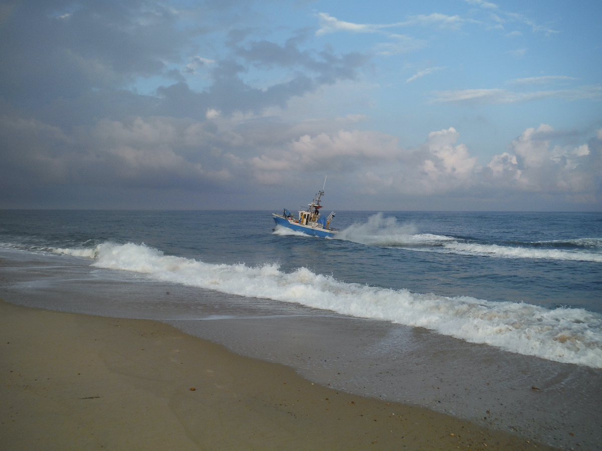
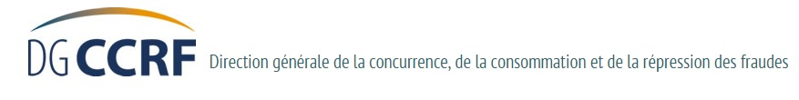

---

_Ce rapport n\'est pas libre de droits. Sa citation et son exploitation commerciale éventuelle doivent respecter les règles fixées par le code de la propriété intellectuelle. Par ailleurs, toute rediffusion, commerciale ou non, est subordonnée à l'accord du secrétaire de l\'ADRM qui en est l\'auteur._

## 

_3 espèces ont monopolisé l\'attention de l\'ADRM : le **bar**, le **maigre** et le **saumon** qui sont dans des situations périlleuses très inégales. Mais le projet majeur qui doit profiter aux trois espèces et à bien d\'autres est celui de l\'**exclusion des filets de la bande marine littorale de 2 MN**._

## 10 actions au niveau international et européen

1.  Demande d\'inscription à la NASCO à Édimbourg (Écosse)

    

    Notre demande d\'enregistrement auprès de la Organisation
    Internationale pour la Conservation du Saumon de l\'Atlantique du
    Nord a reçu un accueil favorable par le secrétariat de
    l\'organisation à Édimbourg en Écosse le 28-09-2018.

    Le dossier de l\'ADRM est en cours d\'examen. L\'ADRM estime que le
    sauvetage du saumon a de fortes chances d\'être notre meilleur
    argument pour repousser les filets au large de la côte aquitaine et
    souhaite **alerter la NASCO sur l\'ampleur des captures
    accidentelles en zone côtière et l\'omerta qui l\'entoure**.

2.  Inscription de l\'ADRM au registre de transparence de l\'UE le 11-08-2018

Cette inscription permet à l\'association de voir ses participations aux consultations place parmi la poignée d\'organisations qui participent à ces consultations, par exemple aux côtés de Client Earth, Oceana ou \...le CNPMEM.

https://ec.europa.eu/info/contributions-public-consultation-fishing-opportunities-2019-under-common-fisheries-policy_en

3. Plainte réf. CHAP(2018)00164 dénonçant le défaut d\'encadrement de la vente directe du poisson

La vente directe de poissons est légale en France et aide considérablement les petits producteurs. L\'ADRM soutient ce principe au même titre que la vente directe des produits de la terre, avec les AMAP. Mais cette activité en pleine expansion doit aussi respecter les règles de transparence et de justice fiscale. L\'ADRM propose un encadrement qui pour l\'instant fait défaut, notamment sur les navires de moins de 10 mètres. La Commission aurait d\'autres priorités. 

1.  _Réclamation devant la DG MARE de l\'UE concernant la taille minimale de commercialisation du bar dans le golfe de Gascogne_

La taille commerciale minimale du bar dans le golfe de Gascogne a été augmentée à 38 cm le 1er janvier 2017 et respecte le minimum communautaire de 36 cm. Mais cette taille reste bien sûr très insuffisante puisque seulement 17% des femelles sont matures. La commission européenne nous a opposé une fin de non recevoir et n\'a manifestement *aucune ambition *pour moraliser les pratiques dans le golfe de Gascogne où 97% des bars sont pêchés par les français. 

1.  [**Pétition n°0574/2018 devant le parlement européen**](https://petiport.secure.europarl.europa.eu/petitions/fr/petition/content/0574%2F../../assets/html/Taille+minimale+du+bar+et+maillage+minimal+pour+les+engins+fixes+ciblant+le+bar+dans+le+golfe+de+Gascogne)
    **pour augmenter la taille minimale de commercialisation du bar dans le golfe de Gascogne à 42 cm**

le secrétariat de la commission des pétitions rédige un résumé de la pétition, qui est ensuite traduit dans toutes les langues officielles de l\'Union européenne.

Comme toutes les pétitions officielles, il faut s\'inscrire sur le site communautaire pour pouvoir soutenir cette initiative. Faites ce petit effort : les bars vous diront Merci !

2.  Plainte réf. CHAP(2018)01937 contre le chalutage dans les 3 milles des eaux françaises

Depuis l\'après guerre, les chaluts d\'Arcachon pêchent la bande littorale d\'abord par « *tolérance*» puis depuis 1995 par « *dérogation* ». 23 telles dérogations existent en France, pour 14 des 16 départements concernés ! Au point que c\'est l\'état de droit qui devient « exceptionnel » en lieu et place de la dérogation prévue par le code rural et de la pêche maritime.

Là aussi, la Commission ne semble _pas très encline à jouer les redresseurs de torts_ et a exprimé sa volonté de classer la plainte.

L\'ADRM a fait appel.

1. Plainte réf. CHAP(2018)01669 dénonçant la pêcherie du maigre en France

© Jean-Claude BONIFACE

La France est quasiment le seul état européen à pêcher le maigre commun, notamment devant l\'estuaire de la Gironde.

Cette pêcherie éteinte depuis la fin des années 60 a subitement ressuscité au début des années 2000, sans qu\'aucune explication probante ne soit avancée, sinon peut être les Oscillations Multi-annuelles Atlantiques (AMO), phénomène climatique.

Depuis, **87% des 600 à 1200 tonnes annuelles de maigre sont des poissons juvéniles de moins de 2 kilos**. Le mâle n\'est mature qu\'au delà de 60 cm (2kg et 4 ans) et la femelle au delà de 80 cm (5 kg et 6 ans). L\'IFREMER a proposé une taille de commercialisation minimale de 80 cm, mais l\'état a préféré _la taille de l\'assiette_: 30 cm.

Comme pour le bar du golfe de Gascogne, la Commission _n\'a pas du tout l\'intention de moraliser_ cette pêcherie scandaleuse : ses bonnes intentions ont de sévères limites.

1.  Pétition n°0556/2018 devant le parlement européen pour légiférer au
    niveau de l\'UE et interdire le chalutage dans les 3 milles sans
    possibilité dérogatoire

    La Pétition a été reçu par le parlement mais n\'a toujours pas été
    diffusée : l\'ADRM aurait-t-elle évoqué _un sujet tabou_?

2.  Plainte réf. CHAP(2018)03644 concernant la possibilité de pêcher le
    saumon dans les eaux territoriales françaises

---

La réponse de la Commission est en attente : l\'ADRM suppose qu\'elle sera encore négative. Mais ce sera peut-être l\'occasion de parfaire nos arguments, _comme à propos du bar et du maigre._ 

---

2. Participation à la [consultation sur les possibilités de pêche 2019](https://ec.europa.eu/info/sites/info/files/contribution-adrm-consultation-on-fishing-opportunities-2019_fr.pdf)

248 intervenants ont participé à la classique consultation européenne sur les possibilités de pêche pour l\'année 2019.

L\'ADRM, régulièrement déclarée sur le registre de transparence de l\'UE y a participé aux côtés d\'autres ONG comme SAVE OUR SEA BASS, ANGLING TRUST, OCEANA ou CLIENT EARTH.

L\'ADRM n\'a pas caché sa lassitude et son inquiétude pour l\'avenir de la pêche dans le golfe de Gascogne, mais a aussi proposé des propositions concrètes que vous pouvez lire à travers un simple résumé ou en détail en cliquant sur [ce lien](https://ec.europa.eu/info/sites/info/files/contribution-adrm-consultation-on-fishing-opportunities-2019_fr.pdf)

## 6 actions au niveau national

1.  Recours amiable contre la taille minimale du bar dans le golfe de
    Gascogne (AM du 24-11-2016) adressé à la Direction des Pêches
    Maritimes et de l\'Aquaculture (DPMA)

    La taille minimale de commercialisation du bar n\'est que de 38 cm
    dans la golfe de Gascogne et nous observons que les bars de 36 cm se
    trouvent toujours sur les étals : comment en serait-il autrement
    puisqu\'il existe toujours une autorisation d\'utiliser des mailles
    de 90 mm pour le bar qui retient des poissons de 34-35 cm ?

    La gestion du bar du golfe n\'est pas durable et faute d\'avoir été
    entendue, l\'ADRM déposera le recours contentieux courant janvier
    2019

2.  Recours amiable contre la taille minimale de commercialisation du
    maigre (AM du 28-01-2013 pour les professionnels)

 © René LACAZE

La taille minimale de commercialisation du maigre a été fixée pour la 1ère fois en 2013 à 30 cm, ce qui correspond à un juvénile de 270 grs et 11 mois. La gestion du maigre est scandaleuse et faute d\'avoir été entendue, l\'ADRM déposera le recours contentieux courant janvier 2019

3. Recours amiable contre la taille minimale de capture du maigre (AM
   du 26-10-2012 pour les amateurs)

   La taille minimale de capture du maigre a été fixée pour la 1ère
   fois en 1999 à 45 cm, annulée en 2007 puis réintroduite en 2012 :
   cette taille correspond à un juvénile de 800 grs et 16 mois. Ce
   n\'est guère plus brillant que pour la taille professionnelle et
   faute d\'avoir été entendue, l\'ADRM déposera le recours contentieux
   courant janvier 2019

4. Participation à la [**_consultation publiquenationale_**](http://www.consultations-publiques.developpement-durable.gouv.fr/projet-d-arrete-relatif-a-l-encadrement-de-la-a1877.html)
   sur le projet d'arrêté relatif à l'encadrement de la pêche de
   l'anguille de moins de 12 centimètres par les pêcheurs
   professionnels en eau douce pour la campagne 2018-2019

La proposition de l\'ADRM de basculer les emplois représentés par cette pêcherie insoutenable vers les « *services environnementaux liés à la pêche* » comme la surveillance et la lutte contre le braconnage a été retenue dans la synthèse des observations, en général très sévères puisque **l\'anguille est sur la liste rouge de l\'UICN** depuis 10 ans déjà. Ces navires seraient aussi moins tentés de pêcher les derniers saumons pyrénéens.

Toutes les contributions et la synthèse sont visibles sur [ce lien](http://www.consultations-publiques.developpement-durable.gouv.fr/projet-d-arrete-relatif-a-l-encadrement-de-la-a1877.html).

1. Saisines multiples de la Commission d\'Accès aux Documents Administratifs

1.  Fin décembre 2018, 5 saisines de la CADA par l\'ADRM sont encore en
    cours :

    à propos de l\'affaire de plus en plus énorme des chaluts
    d\'Arcachon où l\'administration nous refuse la communication des
    nombreux bilans qui démontreraient que les dérogations ont bien été
    attribuées en tenant compte des « exigences de la protection des
    ressources », l\'ADRM a du engager un recours contentieux alors que
    la CADA nous a donné raison.

    4 autres saisines concernent le sujet ultra sensible du saumon de
    l\'Adour où l\'administration a entretenu la désinformation depuis
    plusieurs générations maintenant. Nous sont refusés les accès à un
    document scientifique, aux données concernant les licences CMEA, les
    compte-rendus des travaux du COGEPOMI Adour et surtout le sujet
    tabou des captures accidentelles en mer\...

    D\'autres saisines se sont bien terminées et la CADA est
    incontestablement efficace pour obliger certaines administrations à
    appliquer la loi.

## 13 actions au niveau régional et départemental

1.  Recours contentieux contre le chalutage dans les 3 milles de la
    Gironde

---

Engagé fin mai 2018, l\'échange des mémoires entre l\'ADRM et la DIRM-SA à BORDEAUX est peut-être terminé. Il faut attendre que la Justice tranche sur cette affaire qui représente une agression interminable de la biodiversité des côtes girondines et des chiffres d\'affaires considérables. Ce sera un bon test pour juger de nos juges car le problème est bien là : les juges ne semblent pas avoir encore pris la mesure de l\'effondrement de la biodiversité, comme le déplore l\'UICN. 

---

2. Saisine de la DGCCRF pour abus divers de la vente directe

   Cette action a eu le mérite d\'attirer l\'attention
   de l\'administration sur des sujets dont elle n\'a pas forcément
   pris la mesure.L\'efficacité de cette action se constatera sur le
   terrain. L\'ADRM reste vigilante.

3. Recours contentieux contre les filets fixes des Landes, de la
   Gironde et de la Charente Maritime

Les filets fixes représentent une pratique ancestrale qui est devenue insupportable au point de vue, non pas de la ressource car les prises sont infimes par rapport aux captures professionnelles, mais au point de vue du droit. Un filet de maillage 100 mm ne respecte pas les quotas de bar ni la taille minimale de 42 cm et surtout la pratique est réservée à une minorité dans le pays de l\'égalité.

La Charente-Maritime a aussitôt « retiré » son arrêté qui profite à 2800 pratiquants, mais l\'ADRM n\'a pas retiré son recours pour autant : nous souhaitons la fin de cette pêcherie en France, condition nécessaire (mais très insuffisante) pour le projet de bande marine sans filet.

1.  Recours en référé pour obtenir les bilans de Chalutage dans les 3
    milles de la Gironde

    Action menée en 48h suite au refus de l\'administration de se
    conformer à l\'avis de la CADA qui est favorable à l\'ADRM. Le
    recours a été balayé aussi vite : l\'ADRM a appris à ses dépens que
    la tentative était vouée à l\'échec puisque «_la mesure mise en
    œuvre par le juge des référés ne doit pas faire échec à l'exécution
    d'une décision administrative_». Autrement dit, notre seule issue
    pour faire appliquer l\'avis de la CADA a été de saisir le même
    tribunal mais cette fois par un recours contentieux : on en
    reparlera des bilans des chaluts, dans 2 ans s\'il le faut, mais on
    en reparlera.

2.  Recours contentieux pour obtenir tous les bilans du chalutage dans
    les 3 milles de la Gironde

    Il a donc été logiquement introduit en décembre 2019, après une
    débauche d\'énergie qui en aurait lassé plus d\'un. Mais pas
    l\'ADRM.

85 courriers on été adressés aux ! plus grands distributeurs des trois départements 64,40 et 33.

15% seulement des sondés nous ont répondu ne pas commercialiser du saumon sauvage de l\'Adour.

Ce taux de réponse extrêmement faible est très inquiétant quant à l\'éthique des commerçants pour choisir entre la vente et la protection d\'une espèce menacée.

Mais l\'engagement de CARREFOUR est la toute première victoire de l\'ADRM.

1. Candidature au Conseil Maritime de Façade Sud-Atlantique

   Ce conseil consultatif a été formé en 2017 : l\'ADRM devrait
   attendre le renouvellement puisque il n\'est apparemment pas prévu
   de prendre des membres en route ? Affaire à suivre.

2. Recours amiable contre l\'arrêté du 31-08-2015 (COGEPOMI Adour) et
   l\'arrêté du 29-7-2016 (nomination COGEPOMI)

---

Le saumon de l\'Adour est au bord de l\'extinction, menacé de toutes parts mais encore pêché commercialement. L\'ADRM a soulevé le lièvre : les captures accidentelles sur la côte sont estimées à plus de 4000 individus, auquel il faut ajouter les prises des chaluts et de la bolinche. Le mensonge est organisé depuis la base des pêcheurs jusqu\'au plus haut niveau de l\'État qui fait de fausses déclarations à la NASCO, en passant par les représentants des pêcheurs, des scientifiques institutionnels et l'administration. 

---

1.  Recours amiable contre l\'arrêté du 28-10-2009 (pêche des salmonidés
    dans l\'Adour) et l\'arrêté du 15-9-1993 (Licence CMEA/Amphihalins),

    Dans le contexte évoqué au paragraphe précédent, l\'ADRM a décidé
    d\'attaquer sur tous les angles possibles. Cette stratégie est en
    cohérence avec l\'ampleur des anomalies détectées.

2.  Rencontre du nouvel administrateur en chef des Affaires Maritimes du
    quartier de Bayonne en février 2018

L\'année 2018 avait très bien commencé par un contact positif à Anglet avec le nouvel administrateur des Affaires Maritimes du quartier de BAYONNE, nommé le 1-12-18.

Manifestement, les choses allaient pouvoir changer sur la côte et c\'est ce que nous avons pu constater, avec soulagement concernant le contrôle et des actions auxquelles nous n\'étions pas habitués.

L\'ADRM exprime ici sa reconnaissance.

2. Projet de Bande Marine Littorale sans filets: 50 exemplaires de la 1ère version envoyés à 50 intervenants des Pyrénées-Atlantiques, des Landes et de la Gironde

Cette opération a consommé presque 40% du budget annuel de l\'ADRM mais a eu, semble-t-il les effets à moyen terme escomptés : les portes s\'ouvrent, les contacts se sont multipliés, nos intentions sont clairement comprises, et des négociations s\'engagent sur un projet majeur pour la sécurité des personnes, et le rétablissement de la biodiversité marin littorale.

Ce projet a l\'immense avantade fédérer les énergies en eaux douces et marines.

C\'est le début d\'un long chemin.

1.  Animation de la réunion du 23 juillet à PAU sur le Saumon de
    l\'Adour ( Fédérations 64, 65, 40, AAPPMA du Gave d\'Oloron et
    Migradour)

Cette réunion demandée par l\'ADRM a scellé le début d\'une coalition inattendue entre les pêcheurs en rivière et les pêcheurs en bord de mer qui ont pu découvrir que le saumon était en réalité le trait d\'union qui allait nous donner les moyens de libérer et la côte et l\'estuaire des filets droits et dérivants.

L\'ADRM a bien sûr rajouté son nom sur la liste des personnalités qui exigent la fin de la pêche au filet dérivant dans les limites administratives du port de Bayonne, comme 5 communautés de communes (représentant 222 communes) 2 députés, 2 sénatrices, des conseillers départementaux et généraux, et une multitude d\'associations et fédérations.

1. Participation à la consultation DDTM 64 concernant les dates
   d\'ouverture de la pêche en eaux douces en 2019

   Cette [participation de l\'ADRM](http://www.pyrenees-atlantiques.gouv.fr/Politiques-publiques/Cadre-de-vie-eau-environnement-et-risques-majeurs/Consultation-du-public/Periode-d-ouverture-de-la-peche-en-eau-douce-2019)
   était prévue dans le but de protéger les salmonidés de l\'Adour.
   Comme presque toujours, l\'administration n\'a nullement tenu compte
   du concert de reproches formulés, notamment sur des pratiques de
   pêche au filet pour la lamproie dont on sait qu\'elles capturent des
   saumons.

   http://www.pyrenees-atlantiques.gouv.fr/Politiques-publiques/Cadre-de-vie-eau-environnement-et-risques-majeurs/Consultation-du-public/Periode-d-ouverture-de-la-peche-en-eau-douce-2019

## 6 actions médiatiques

1.  Naissance du site de l\'ADRM fin juillet 2018 :
    https://www.defensedesmilieuxaquatiques.org//

2.  Page Facebook dédiée: https://www.facebook.com/maigre40

3.  Distribution de tracts pendant l\'été 2018 sur la côte en Gironde

4.  Participation de 4 membres de l\'ADRM au magnifique documentaire
    diffusé à partir du 2 décembre par SEASON \"**La bataille pour la
    ressource**\" de Didier LAURENT et Antoine de CHANGY ([Les films du
    bouchon](https://lfdbproduction.com/))

5.  Soutien à DARWIN menacé par les promoteurs qui louchent sur le
    terrain et pressé de toutes parts :
    http://www.bordeaux-gazette.com/le-torchon-brule-entre-bma-et-darwin.html

    \"_L\'Association de Défense des Ressources Marines apporte son
    soutien sans réserve à l\'œuvre incarnée par DARWIN. Philippe BARRE
    et ceux qui la construisent tous les jours sont les exemples à
    suivre pour éviter la catastrophe annoncée, BMA et ceux qui s\'y
    opposent seront refoulés par le bon sens public qui grandit chaque
    jour et qui un jour prochain indiquera enfin la bonne direction à
    nos décideurs perdus._\"

6.  Participation remarquée de l\'ADRM à CLIMAX 2018 avec de nombreuses
    rencontres constructives et apportant des liens forts. Vidéo sur la
    question posée à l\'Agence Française de la Biodiversité à propos des
    Chaluts d\'Arcachon

    en ligne sur le site : https://www.defensedesmilieuxaquatiques.org//le-chalutage-dans-les-3-milles

## 3 résultats acquis par l\'ADRM en 2018 (cf. pièces jointes)

---

- [Renoncement définitif et officiel par CARREFOUR ANGLET de commercialiser le saumon sauvage de l\'Adour](https://docs.wixstatic.com/ugd/b647dc_6a09a78c66d1435a80389f7f78ccffa8.pdf) (22-10-2018)

- [Garde-à-vue dans l\'affaire de la pêche professionnelle du bar au filet maillant encerclant dans les baïnes](https://docs.wixstatic.com/ugd/b647dc_8480d014900d43ed9f4aecf8db957e25.pdf) (20-11-2018)

- https://docs.wixstatic.com/ugd/b647dc_e629124f708e4aeca5b8335b8cc351dd.pdf (23-11-2018)

---

## 1 projet phare de l\'ADRM: la bande marine sans filet

Le projet majeur de l\'ADRM est de faire admettre qu\'il faut protéger
la bande marine littorale de façon complète. L\'exclusion des filets
doit soulager les nourriceries, les amphihalins en transit (saumons,
aloses et esturgeons), les oiseaux marins, les cétacés et les tortues
marines.

Sur la plan social, ce projet sécurise la profession des marins
pêcheurs, repousse les risques d\'accident avec les autres usagers et
diminue les conflits d\'usage.

Le projet en est à sa 3ième version (janvier 2019), 150 pages richement
illustrées et consultables en ligne sur le site de l\'association :
https://www.defensedesmilieuxaquatiques.org//bande-marine-littorale-sans-filet
