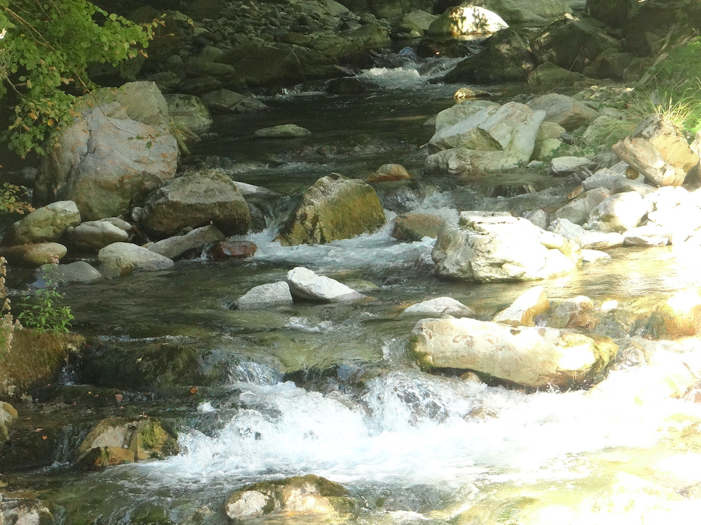
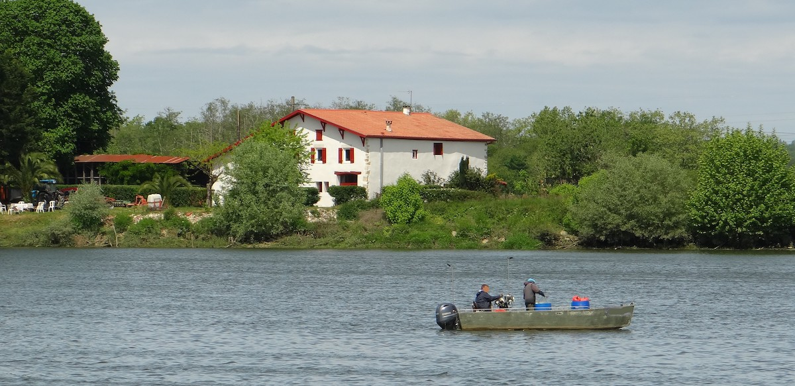
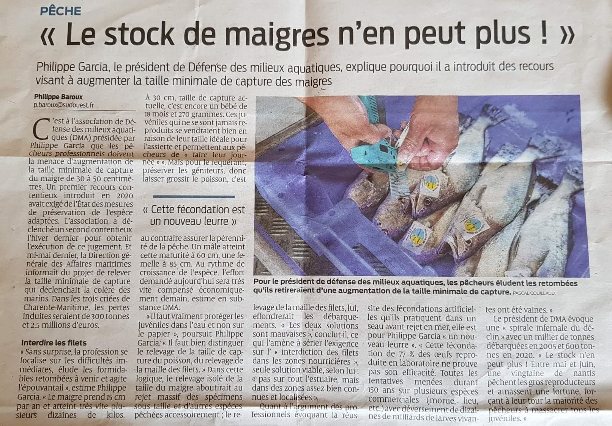

---

Ce rapport n\'est pas libre de droits. Sa citation et son exploitation commerciale éventuelle doivent respecter les règles fixées par le code de la propriété intellectuelle. Par ailleurs, toute rediffusion, commerciale ou non, est subordonnée à l'accord du président en exercice de DÉFENSE DES MILIEUX AQUATIQUES qui en est l\'auteur.

---

### Résumé
En 2022, l\'association a déposé plus d\'une vingtaine de recours notamment à propos des poissons migrateurs de la Nouvelle-Aquitaine, tout en étendant sa contestation aux bassins Rhône-Méditerranée, Artois-Picardie et Normandie. 

Elle estime insuffisant le nouvel arrêté de pêche maritime dans l\'estuaire de la Gironde ainsi que l\'augmentation de la taille minimale du maigre de cinq petits centimètres. 

Elle est la première à attaquer l\'autorisation préfectorale d\'une nouvelle microcentrale hydroélectrique dans le gave du Gabarret, en vallée d\'Aspe (Pyrénées-Atlantiques).

L\'année démarre avec l\'annulation en janvier 2022 de l\'arrêté organisant la pêche maritime au filet dans l\'estuaire de la Gironde au nom de la protection communautaire des poissons migrateurs et notamment de l\'esturgeon (directive Habitats).

Après la suspension des filets dérivants de l\'Adour pour le bénéfice des Aloses et des Lamproies marines en juillet 2021, une coalition d\'associations emmenées par DÉFENSE DES MILIEUX AQUATIQUES obtient le même résultat en avril 2022 après avoir suspendu le nouveau plan de gestion des poissons migrateurs en mars 2022. 

Dans le bassin Garonne-Dordogne, l\'association obtient aussi la suspension du nouveau plan de gestion des poissons migrateurs fin mars 2022 puis l\'annulation de la pêche de la lamproie marine dans tout le bassin en mai 2022. Comme prévu, l\'association est [agréée pour la protection de l\'environnement](https://www.nouvelle-aquitaine.developpement-durable.gouv.fr/IMG/pdf/assos_agreees_na_2022_12_16.pdf) au niveau de la région Nouvelle-Aquitaine à partir du 26 septembre 2022.

Au cours de l\'année 2022, l\'association DÉFENSE DES MILIEUX AQUATIQUES
a introduit 27 recours et 5 demandes d\'exécution. Elle a participé à
neuf consultations publiques et a déposé trois plaintes devant la
Commission européenne.

En janvier 2022, une équipe de DÉFENSE DES MILIEUX AQUATIQUES sauve un
jeune phoque gris étranglé par un filet de pêche qui sera relâché deux
mois plus tard par le musée de la Mer de Biarritz.

L\'association organise une manifestation en mai à Urt (64240) puis en juillet à
Bayonne (64100) pour demander la fin de la pêche au filet dérivant dans
l\'Adour. Elle participe au colloque sur les poissons migrateurs début
juillet à Pessac (33600) où elle présente son poster sur la bande marine
sans filets. 

Elle publie une vidéo proposant le rachat des licences des
pêcheurs professionnels fluviaux. En plein été, elle dénonce les
multiples pompages du gave d\'Oloron (64400) en plein étiage sévère.

Elle est présente à la manifestation d\'octobre contre l\'extraction des galets du gave d\'Oloron à Carresse-Cassaber (64270).
Elle participe à quelques échanges (radio, conférences-débats) et participe au comité
opérationnel de lutte contre la délinquance de la Vienne.

En décembre, l\'association décide de créer un compte sur le réseau social LinkedIn
pour répliquer à la communication de France Hydroélectricité à propos du
projet de microcentrale sur le gave du Gabarret en vallée d\'Aspe dans
les Pyrénées-Atlantiques.

### 1. Plus de 20 recours administratifs introduits en 2022

Suite aux deux premières suspensions obtenues en juillet 2021,
l\'activité juridique de DÉFENSE DES MILIEUX AQUATIQUES se concentre en
2022 sur les poissons grands migrateurs amphihalins de la
Nouvelle-Aquitaine (saumons, truites de mer, aloses, lamproies,
anguilles et esturgeons) et s\'étend logiquement à d\'autres bassins
(Rhône-Méditerranée, Artois-Picardie et Normandie).

Suite au jugement 2100741 et toujours pour ces espèces, nous poursuivons notre effort dans
l\'estuaire de la Gironde. Pour le maigre, l\'association dénonce des
mesures qui manquent leur but puisqu\'elles ne changeront pas le destin
de l\'espèce. Pour la première fois, l\'association introduit un recours
contre un projet de microcentrale hydroélectrique qui, pour une poignée
de mégawattheures non garantis propose de défigurer le merveilleux gave
du Gabarret au fond de la vallée d\'Aspe (Pyrénées-Atlantiques).

L\'association ne manque pas de contester les nouveaux cahiers des
charges du droit de pêche qui persistent à autoriser l\'usage du filet
dérivant dans nos fleuves ou les nasses à lamproies alors que l\'espèce
est très menacée et sa pêche suspendue ou annulée.

1.  Demandes d\'exécution des jugements 2100681 (dossier **2200590**) et
    2100705 (dossier**2200589**) (pêche aux engins et filets des aloses
    et lamproies de l\'Adour autorisée à nouveau par le nouveau
    PLAGEPOMI 2022-2027)
2.  Demandes d\'annulation et de suspension des deux PLAGEPOMI Adour
    (dossiers **2200417** et **2200418** le 25 janvier) et Garonne
    2022-2027 (dossiers **2200433 et 2200574** le 1er février) devant le
    tribunal administratif de BORDEAUX en ce qu\'ils concernent la pêche
    aux engins et filets des poissons migrateurs
3.  Recours devant le tribunal de PAU n°**2200342** pour obtenir la
    transmission des captures de saumon, alose et lamproies en 2020 et
    2021 de la part du CRPMEM NA
4.  Appel des jugements 1902754 et 1902804 à propos des arrêtés de pêche
    annuel et permanent dans les Pyrénées-Atlantiques pour 2020 devant
    la cour d\'appel de BORDEAUX (dossiers **2200557**et **2200556)**
5.  Recours contre la décision implicite de rejet de la demande de
    l\'association Défense des Milieux Aquatiques par la mairie de
    Larzac communication de la procédure d\'autorisation de deux
    activités en zone humide le long de la rivière La NAUZE **(dossier 2201220)**
6.  Recours en annulation et en référé contre l\'arrêté annuel 2022 de
    pêche des migrateurs dans les Landes (dossiers **2200495** et
    **2200485**). Demandes d\'exécution des suspensions prononcées le 22
    avril 2022 pour les deux référés.
7.  Recours devant le tribunal administratif de Nantes n°**2203297**
    contre la DIRM-NAMO pour obtenir les travaux de deux comités
    relatifs à la gestion de la flotte et au fond européen pour les
    affaires maritimes (CORESEL et CRGF)
8.  Recours en annulation et en référé contre l\'arrêté annuel 2022 de
    pêche des migrateurs dans les Pyrénées-Atlantiques (dossiers
    **2200597** et **2200614**)
9.  Appel contre le jugement 1900159 (PLAGEPOMI Adour) devant la cour
    d\'appel de BORDEAUX (dossier **2200927**)
10. Pourvoi en cassation demandant l'annulation de l'ordonnance 2200418
    en tant qu'elle a rejeté nos demandes concernant le saumon
    atlantique. (dossier **462882**)
11. Recours demandant la transposition de l\'article 6(1) de la
    directive Habitats et l\'indemnisation des pêcheurs introduit devant
    le TA de BORDEAUX (dossier **2202484**)
12. Recours en annulation contre le PLAGEPOMI Rhône-Méditerranée
    (Dossier **2203541**)
13. Recours en annulation contre l\'arrêté de pêche maritime des
    poissons migrateurs en Artois-Picardie devant le TA de ROUEN
    (dossier **2202119**)
14. Recours contre la DREAL NA et la DPMA pour refus de transmissions
    des captures de migrateurs en 2020-2021 sur l\'Adour (dossier
    **2212061** (TA de Paris) ==\> dossier **2206185** (TA de Bordeaux).
15. Recours en annulation contre le nouvel arrêté de pêche 2022 des
    poissons migrateurs dans les Landes (dossier **2201603**)
16. Recours en annulation contre le Cahier des charges 64-40 (dossier
    **2201689)**
17. Recours en annulation contre le Cahier des charges 33 (dossier
    **2204106)**
18. Recours en annulation contre le Cahier des charges 24 (dossier
    **2204185**)
19. Recours en annulation contre l\'arrêté n°307 de la préfète de la
    région Nouvelle Aquitaine du 28 juillet 2022 portant réglementation
    de la pêche maritime dans l\'estuaire de la Gironde et à son
    embouchure jusqu\'au 31 décembre 2024 (dossier **2204859**)et
    demande d\'exécution du jugement **2100741.**
20. Recours en annulation contre l\'arrêté du 23 août 2022 relatif à
    l\'encadrement de la pêche professionnelle et de loisir du maigre
    commun (_Argyrosomus regius_) (dossier **467610**)
21. Recours en annulation contre le projet de la microcentrale
    hydroélectrique du Gabarret (dossier **2202183)**
22. Recours en annulation contre l\'arrêté n°134/2022 de la Direction
    Interrégionale de la mer Manche Est -- Mer du Nord en date du 05
    septembre 2022 portant mises en réserve de pêche pour les poissons
    migrateurs dans la région Normandie et contre l\'arrêté n°165/2022
    de la Direction Interrégionale de la mer Manche Est -- Mer du Nord
    du 25 octobre 2022 portant réglementation de la pêche des poissons
    migrateurs dans la partie maritime des estuaires, cours d\'eaux et
    canaux de Normandie pour la période 2022-2023 (dossier **2204699**
    avec ANPER-TOS)

### 11. Une quinzaine de recours pour suspendre et annuler les pêches aux engins et filets des poissons migrateurs

Dans l\'Adour, les suspensions de juillet 2021 sont curieusement
publiées très tard, à la fin de la saison de pêche qui n\'a
donc pas été contrariée le moins du monde. De plus, ces suspensions ont bien peu d\'effet dans la rédaction des nouveaux arrêtés de pêche
pour 2022. Le seul effet se résume au report de la date d\'ouverture de
la pêche du saumon et de l\'alose de début mars à début avril, ce qui a
probablement épargné quelques précieux saumons femelles, mais si peu.
Sous l\'impulsion de DÉFENSE DES MILIEUX AQUATIQUES, la coalition
d\'associations formée en 2021 conteste donc le nouveau
PLAGEPOMI[^1]2022-2027 et les deux arrêtés de pêche dans les
Landes et les Pyrénées-Atlantiques, en annulation et en
référé-suspension. Les trois référés seront favorablement
accueillis, les arrêtés sont suspendus mais les filets restent sur
l\'eau et continuent de pêcher\...

Combien de poissons ont bénéficié de ces suspensions ? Probablement
très peu. Mais une avancée juridique majeure survient : en reconnaissant
que le défaut d\'évaluation des incidences est un doute sérieux quant à
la légalité de l\'acte, les juges reconnaissent implicitement, sans
présumer du verdict de cette évaluation, que ces activités de pêche
pourraient bien être illégales ! La porte s\'entre-ouvre petit à petit
pour se débarrasser enfin de ces pratiques anachroniques et
scandaleuses.

Dans le bassin Garonne-Dordogne, l\'association attaque seule le
PLAGEPOMI 2022-2027 qui est suspendu le 30 mars 2022 sur le même
fondement que sur l\'Adour. Là aussi, même recette, mêmes effets, les
annulations de la pêche de la lamproie dans les trois départements de la
Gironde, de la Dordogne et du Lot-et-Garonne, soigneusement publiées
\*après* la période de migration ne contrarient nullement la
pêche. Pire que cela, les cahiers des charges de l\'exploitation du
droit de pêche de l\'État qui doivent être renouvelés pour les cinq
prochaines années ne prévoient aucune diminution de l\'arsenal des
engins de pêche ciblant la lamproie. L\'association devra bien
évidemment contester les nouveaux textes 2023, en y rajoutant les
nouveaux cahiers des charges.

[Lire l\' article de la Peste et la
relève](https://lareleveetlapeste.fr/dans-ladour-peches-illegales-de-saumons-et-poissons-migrateurs-avec-la-complicite-de-la-prefecture/)

### 12. L\'estuaire de la Gironde, sanctuaire des poissons migrateurs et des maigres

L\'annulation d\'un vieil arrêté de 2014 organisant la pêche maritime
dans l\'estuaire de la Gironde dès la mi-janvier va obliger
l\'administration à revoir sa copie en six mois. Mais sans surprise là
aussi, les mesures proposées pour soulager les migrateurs sont bien
dérisoires. Il est prévu que le temps d\'immersion des filets soit
limité à trois heures par jour (en pleine saison de migration), comme
s\'il était démontré quelque part (?) que cette mesure de papier soit
efficace.

Quant à l\'augmentation de cinq centimètres de la taille minimale du
maigre, elle ne change rien à la totale immaturité des femelles à 35 cm
ni même à 50 cm. L\'association le démontre à partir des séries
gonadiques d\'IFREMER. Les deux zones 1 et 2 d\'interdiction de pêche du
maigre au printemps n\'auront pas davantage d\'effet puisque, carte de
référence à l\'appui, il est clair que l\'on ne pêche pas de maigre dans
cette zone. Ces évidences semblent vaines, puisqu\'à la mi-décembre
2022, le rapporteur public n\'hésite pas à rejeter nos conclusions deux
jours avant une audience en Conseil d\'État où nous avons été prévenus
que nous n\'aurons même pas le droit de nous exprimer. Le jugement
458566 du 6 janvier 2023 nous déboute effectivement au motif que des
mesures ont bien été prises et que le caractère suffisant de ces mesures
ne relèverait pas de ce litige! Le Conseil d\'État qui avait pris soin
de fonder son jugement 428271,428576 du 8 juillet 2020 sur le fondement
de l\'article L911-2 du code de justice administrative et non sur le
L911-1 apparaît bien comme le Gardien de l\'État.

### 13. Le Gave du Gabarret, lui comme tant d\'autres dans un tuyau d\'acier ?

Après deux consultations publiques, des avis très négatifs et réitérés
du Conseil National de la Protection de la Nature et de l\'Autorité
Environnementale, la préfecture des Pyrénées-Atlantiques autorise un
pétitionnaire à dériver plus de 80% du débit du merveilleux gave du
Gabarret, pourtant déjà exploité en amont (!), pour produire quelques
kilowattheures de plus.

L\'administration choisit la veille du long week-end du 15 août pour
publier l\'autorisation du projet de microcentrale hydroélectrique.
C\'est l\'un des derniers torrents de montagne encore à peu près
préservés, sur les communes d\'Aydius et de Bedous.

2 km 650 de tronçon court-circuité seront laissés exsangues avec un
débit résiduel divisé par 6, correspondant à un étiage sévère. Histoire
de réduire ses propres contraintes plutôt que les impacts
environnementaux, le pétitionnaire évince le saumon et quelques autres
espèces précieuses et met en avant trois mesures de compensation sans
effet. Les dérogations pour espèces protégées concernent 34 espèces dont
11 chauve-souris, 9 reptiles, 6 amphibiens, 6 mammifères. La loutre, le
desman des Pyrénées et les crossopes font partie du cortège des espèces
sévèrement impactées.

La production annoncée à 7,2 gigawattheures, estimée sans tenir compte
de la baisse des débits liée au réchauffement climatique, est de
l\'ordre du millionième de la consommation énergétique française. Pour
quelques retombées fiscales, les deux municipalités n\'ont pas hésité à
sacrifier une partie de leur cadre de vie et de notre patrimoine
naturel. Mais la cour d\'appel de BORDEAUX a refusé de considérer que
l\'intérêt public d\'une production hydroélectrique de 12 gigawattheures
puisse être considéré comme majeur. La cour d \'appel de MARSEILLE a
pris la même décision avec un parc éolien avec une production de plus de
60 gigawattheures. Le tribunal administratif aura donc prochainement à
se prononcer sur cette affaire consternante.

Le desman des Pyrénées est une taupe qui cherche sa nourriture non pas
dans le sol mais dans le fonds des torrents de montagne. Sa flottaison
naturelle qui le préserve de la noyade l\'oblige à utiliser
astucieusement les remous des rapides pour se faire propulser au fond du
cours d\'eau où il se maintient et évolue en apnée grâce à de solides
griffes palmées pendant une trentaine de secondes. C\'est là, sous les
cailloux et galets des gaves et torrents pyrénéens, qu\'il trouve les
larves aquatiques d\'éphémères, de trichoptères et de plécoptères qui
nourrissent aussi les truites et bien d\'autres espèces. Véritable
fossile vivant, le desman est une espèce endémique menacée dont l\'aire
de répartition déjà mitée ne cesse de se fragmenter à cause de
l\'artificialisation des cours d\'eaux et notamment le détournement des
débits pour alimenter une turbine hydroélectrique. L\'effondrement des
débits fait disparaître les rapides écumeux, terrain de chasse le plus
favorable pour le desman et effondre la production primaire du torrent,
au grand dam de tout l\'écosystème.

C\'est la double peine pour le desman, menacé en vallée d\'Aspe par un
énième projet de microcentrale du Gabarret qui devrait produire, si
l\'on en croit ses promoteurs, à peine 7,2 Gwh, soit la consommation
électrique de 3000 personnes. Et pour une telle production, ce projet
menace bien d\'autres organismes, comme les musaraignes aquatiques, le
calotriton, plusieurs autres batraciens, la loutre, le cincle plongeur
et la bergeronnette des ruisseaux pour n\'en citer que quelques-uns.

---

### 2. Plaintes à la Commission européenne en 2022

Au 1er janvier 2023, DÉFENSE DES MILIEUX AQUATIQUES a déposé _quatorze
plaintes_ devant l\'Union Européenne :

21\. Plainte CHAP(2018)00164 du 11-1-20218 contre les dérives de la
vente directe de poissons

22\. Plainte CHAP(2018)01669 du 25-5-2018 concernant la pêche du maigre
en France

23\. Plainte CHAP(2018)01937 du 15-6-2021 contre le chalutage
dérogatoire dans les trois milles

24\. Plainte CHAP(2018)03278 du 30-9-2018 contre les filets fixes des
amateurs sur l\'estran

25\. Plainte CHAP(2018)03644 du 29-10-20218 concernant l\'arrêté du
15-9-1993 (licences pour pêcher les poissons amphihalins)

26\. Plainte CHAP(2019)01887 du 01-07-2019 concernant trois aires NATURA
2000

27\. Plainte CHAP(2019)01959 du 01-07-2019 concernant les captures
accidentelles de dauphins

28\. Plainte CHAP(2019)03120 du 31-10-2019 concernant l\'article L414-4
du code de l\'environnement

29\. Plainte CHAP(2020)00946 du 08-4-2020 contre le chalutage dans les
pertuis

210\. Plainte CHAP(2020)00808 du 21-03-2020 concernant l\'article L414-4
du code de l\'environnement

211\. Plainte CHAP(2021)04336 du 13-12-2021 pour défaut de transposition
de l\'article 6(1) de la directive Habitats Faune Flore.

Trois nouvelles plaintes ont été déposées en 2022 :

Plainte CHAP(2022)00530 du 15-2-2022 pour défaut de transposition de
l\'article 4(1,2) de la directive Oiseaux.

Plainte CHAP(2022)01233 du 6-5-2022 pour défauts de transposition de la
directive Habitats.

Plainte CHAP(2022)02461 du 31-8-2022 contre la microcentrale
hydroélectrique du Gave du Gabarret.

Par des raisons de confidentialité sur ces affaires dont certaines
sont en cours, le conseil d\'administration de l\'association a décidé
de ne pas communiquer davantage.

### 3. Consultations publiques de 2022

En 2022, forte d\'une expérience de cinq années, DÉFENSE DES MILIEUX
AQUATIQUES estime que la contribution citoyenne dans les consultations
publiques n\'influence pas de façon significative les décisions
concernées. Par souci d\'énergie et de temps, nous avons
intentionnellement réduit notre participation de 50% et espérons
seulement partager notre point de vue avec ceux qui font l\'effort de
nous lire. 

1.  Avis sur le projet d\'extension de la réserve nationale des
    Marais d\'Yves en Charente-Maritime

2.  Audition dans le cadre du développement de la pisciculture en
    France avec Patrick FALCONE (Ministère de l\'Agriculture et de
    l\'Alimentation) et Frédéric SAUDUBRAY (Conseil Général de
    l\'Environnement et du Développement Durable) 

3.  Avis sur le projet éolien au large de l\'île d\'Oléron

4.  Consultation sur les projets d\'arrêtés fixant les périodes
    d\'ouverture de la pêche en eau douce pour les espèces migratrices
    dans les Pyrénées-Atlantiques et les Landes en 2022

5.  Consultation sur l\'arrêté portant mises en réserves de pêche
    pour les poissons migrateurs dans la région Normandie

6.  Consultation sur le projet d\'arrêté fixant les périodes
    d\'ouverture de la pêche en eau douce pour les espèces migratrices
    dans les Landes 

7.  Consultation à propos du cahier des charges du droit de pêche de
    l\'État géré par la DDTM en Gironde pour la période 2023-2027

8.  Consultation sur les déclarations des captures accidentelles
    d\'espèces de l\'annexe IV de la directive Habitats

9.  Consultation sur les nouvelles tailles minimales du maigre

    ***

### 31. Projet d\'extension de la réserve nationale du Marais d\'Yves en Charente-Maritime

L\'association DÉFENSE DES MILIEUX AQUATIQUES soutient le projet
d\'extension de la  réserve naturelle nationale des marais d\'Yves dont
la superficie sera multipliée par un facteur 6.

Mais les deux mesures réglementaires prévues pour la pêche sont trop
faibles.

Il est prévu de tolérer la pêche professionnelle au filet maillant « 
jusqu\'au départ du pêcheur ou du navire » et la pêche au carrelet
devrait pouvoir se poursuivre indéfiniment.

L\'association estime qu\'il aurait fallu :

- exiger que la pêche professionnelle au filet maillant cesse avec le
  départ du pêcheur même si le navire reste, car l\'éventualité d\'un
  nouveau pêcheur qui achèterait ce navire pourrait faire durer la
  pratique indéfiniment.

- s\'opposer à la tolérance de la pêche amateure au carrelet qui doit
  disparaître puisqu\'elle tue des alevins d\'espèces variées chaque
  jour, notamment des alosons, espèces d\'intérêt communautaire
  inscrites sur les annexes II et V de la directive Habitats et dûment
  protégées par les zones spéciales de conservation loco-régionales.

### 32. Audition dans le cadre du développement de la pisciculture en France

Le rapport de Patrick FALCONE (Ministère de l\'Agriculture et de
l\'Alimentation) et Frédéric SAUDUBRAY (Conseil Général de
l\'Environnement et du Développement Durable) *que nous ne
commentons pas* est disponible ici : [rapport IGEDD du
29-11-2022](https://www.igedd.developpement-durable.gouv.fr/developpement-de-la-filiere-piscicole-a3574.html)

---

### 33. Avis sur le projet éolien au large de l\'île d\'Oléron

---

DÉFENSE DES MILIEUX AQUATIQUES s\'oppose au projet éolien d\'OLÉRON pour
trois raisons principales :

1.  L\'éolien ne diminue pas les gaz à effet de serre produits par un
    État et aucun débat n\'a eu lieu sur le nucléaire.

2.  Sur ce projet précis, les choix fondamentaux sont déjà faits alors
    que la connaissance des impacts est balbutiante, ce que reconnaît la
    fiche 16 :\"Cette évaluation des impacts sera réalisée par les
    porteurs de projet (le développeur éolien et RTE) dans une étude
    d'impact, **après le débat public** \"

3.  Il est irrecevable de prévoir de tels projets industriels dans des
    aires NATURA 2000 où aucune détérioration d\'habitats n\'est
    admissible. C\'est une _rupture du contrat communautaire_.

    De plus, toutes les questions relatives aux multiples impacts
    environnementaux ne reçoivent _aucune_ réponse.

\(1\) La fiche 11 affirme que \"_l'intermittence des éoliennes en mer,
dont la production varie avec le vent, ne nécessitera pas de
construction de nouvelles unités de production pilotables comme les
centrales thermiques pour assurer la sécurité d'approvisionnement
électrique._\" Au seul motif de produire de l\'énergie renouvelable et
que le secteur connaît une croissance forte, il faudrait créer des
éoliennes partout où cela est possible. Or le développement de
l\'éolien, du fait de l\'intermittence de la production, n\'a *jamais
*permis de diminuer la production de gaz à effet de serre, comme cela
est démontré depuis 20 ans en Espagne, au Danemark ou encore en
Allemagne. C\'est donc une fausse bonne solution puisque, contrairement
à ce qui est dit, elle s\'accompagne inéluctablement de centrales de
production d\'énergie pilotables, c\'est-à-dire basées sur les énergies
fossiles.

\(2\) La question sur la puissance du parc élude la question de la
pertinence du choix de l\'éolien qui n\'est pas posée. Le choix proposé
de la puissance n\'est pas un choix puisqu\'il est déjà prévu de
rajouter un autre projet ensuite encore plus puissant. La question de la
zone préférentielle au sein d\'une zone restreinte déjà choisie élude la
question du vrai choix de l\'éolien flottant au large et non aussi près
de la côte. Les grandes questions qui se posent sont donc : faut-il
s\'engager dans l\'éolien et si oui, faut-il choisir du flottant au
large ou du posé au bord. Ces deux questions ont déjà été tranchées par
une poignée de personnes de sorte que cette consultation publique n\'est
qu\'un pantomime.

\(3\) Les aires NATURA 2000 sont des zones sous statut juridique de la
directive Habitats. Selon l\'article 6(1) de cette directive, les États
membres doivent prendre toutes les mesures nécessaires pour répondre aux
exigences écologiques des habitats et des espèces protégées figurant sur
les annexes I et II de la directive. Selon l\'article 6(2), toute
détérioration d\'habitats doit être évitée. Selon l\'article 6(4), une
dérogation ne peut être décidée qu\'à la triple condition qu\'il n\'y
ait pas d\'alternative, que le projet soit justifié par des raisons
impératives d\'intérêt public majeur et qu\'il soit mis en place des
compensations effectives traitant des impacts environnementaux. De toute
évidence, le débat sur les alternatives et les compensations n\'existe
pas pour l\'instant.

On apprend que \"_les acteurs locaux ont très tôt fait valoir leur
engagement vis-à-vis du projet_\" : il faut dire qu\'ils ont été achetés
à coup de véritables rentes annuelles avec 0,465 M€ (millions d\'euros)
pour le sauvetage en mer, 0,93 M€ pour l\'OFB, 3, 3 M€ pour le comité
régional des pêches et 4,6 M€ pour les communes littorales. De quoi
faire taire les contestations et attirer les engagements.

Saisir l\'Autorité environnementale et consulter le public _le plus tôt
possible_ pour divers motifs n\'empêche pas que cela devrait se faire
_APRÉS_ les études d\'impacts pour que tous ces avis soient éclairés,
constructifs et utiles. On a aucun retour des \"fermes pilotes\" dont
l\'objectif était justement de nous éclairer par leurs résultats
préliminaires. **On a mis la charrue avant les bœufs**, comme bien
souvent.

Les impacts environnementaux sont certains et l\'incertitude des
connaissances ne porte que sur leur ampleur, qui sera forte ou très
forte. On s\'apprête donc, au nom du climat et d\'un effet _escompté_ de
réduction des gaz à effet de serre mais _démenti_ par la longue
expérience de pays voisins, à saccager de nouveaux espaces naturels et
ainsi aggraver notre impact sur la biodiversité au moment même où il
nous faut le réduire. C\'est un double grosse erreur.

Parmi la multitude de menaces environnementales qui se profilent, nous
sommes très inquiets des trois menaces suivantes :

1.  Quelle est l\'identité véritable et les risques de l'huile
    inflammable servant d'isolant électrique dans les transformateurs ?
    On pense aux dégâts définitifs des pyralènes et autres PCB interdits
    depuis les années 80 mais toujours présents dans la nature \...

2.  Anodes sacrificielles de 9 tonnes d\'aluminium : les modélisations
    ne sont pas encore faites, l\'écotoxicité de l\'aluminium n\'est pas
    complètement connue mais la fiche 16-01 s\'empresse déjà d\'affirmer
    que la diffusion de l\'aluminium sera « *négligeable* ».

3.  Les promesses d\'utiliser des peintures antifouling moins intensives
    en biocides et d\'améliorer les anodes sacrificielles par une
    protection à courant imposé de la fiche 16-05 ne disent pas ce que
    vont être les impacts véritables.

La question sur l\'opportunité du projet rajouté par la commission du
débat public est complètement pertinente. L\'alternative à ce projet
d\'éolien proche du bord est d\'envisager de le faire au large, en
DEHORS des aires NATURA 2000, d\'autant que le prix de l\'éolien
flottant (au large \> 50 mètres) diminue et rattrape 5 ans plus tard
celui du posé (\< 50 mètres) et APRÈS en savoir beaucoup plus sur les
impacts environnementaux prévisibles.

La priorité doit désormais revenir à l\'environnement.

Même si le projet est éloigné vers le large et qu\'on attende d\'en
savoir davantage sur toutes les questions sans réponse, il faudra des
compensations. Or \"_les mesures compensatoires sur le plan
environnemental sont bien moins connues_\" comme il est reconnu et les
compensations énumérées par la fiche 16-05 sont bien rares et prêtent
toutes à critique :

• Participer à des campagnes de **repeuplement d'espèces** : les
campagnes de repeuplement en mer entreprises depuis le milieu du XIXième
siècle n\'ont JAMAIS fonctionné.

• Restaurer ou réhabiliter des **habitats** : de quels habitats
s\'agit-il ?

• Réaliser des campagnes de **«neutralisation de prédateurs»** : de
quels prédateurs s\'agit-il ? Que veut dire \"neutralisation\" ???

Nous proposons que les habitats détruits par un projet éolien soient
intégralement \"compensés\" par des surface d\'habitats qui seraient
définitivement soulagées de la pression du chalutage de fond par une
interdiction définitive de ce type de pêche. Par exemple, il serait
judicieux d\'interdire définitivement le chalutage dans les pertuis pour
en soulager efficacement les nourriceries .

En conclusion, nous nous opposons à la fois au projet global de
développer l\'énergie éolienne et au projet local d\'Oléron parce
qu\'ils sont totalement immatures. Nous estimons qu\'il faudrait plutôt
lancer deux débats publics :

- sur les moyens de **réduire notre consommation moyenne d\'énergie,** problématique plus que jamais fondamentale,

- sur l\'**énergie nucléaire** qui est manifestement l\'alternative à
  évaluer publiquement,

---

### 34. Consultation sur le projet d\'arrêté fixant les périodes d\'ouverture de la pêche en eau douce pour les espèces migratrices dans les Pyrénées-Atlantiques et les Landes en 2022

---

Les deux projets d\'arrêtés autorisent toujours la pêche commerciale des
lamproies, des aloses, et du saumon dans l\'Adour pourtant classé NATURA
2000 pour protéger ces espèces.

Depuis le 23 septembre 2016, date à laquelle l\'Adour est devenu Zone
Spéciale de Conservation pour ces espèces, les dispositions de
l\'article 6 alinéa 1 de la directive habitats sont devenues
obligatoires. Elles imposent à la France de prendre « *toutes les
mesures nécessaires répondant aux exigences écologiques* » des espèces
inscrites à l\'annexe II et protégées au sein de l\'aire NATURA 2000
dédiée de l\'Adour. Puisque la première des exigences de ces poissons
est de vivre, la première des mesures à prendre était donc d\'en
interdire la pêche extractive et notamment celle pratiquée avec des
engins et filets de pêche, ici exclusivement pratiquée avec des filets
dérivants.

Le PLAGEPOMI Adour 2022-2027 sur lequel s\'appuient les arrêtés soumis à
consultation fixe les périodes de pêche de ces poissons migrateurs et
organise donc autant de violations évidentes de la directive Habitats
depuis sa désignation en septembre 2016 en Zone Spéciale de Conservation
ou aire NATURA 2000 pour les poissons migrateurs.

Les arrêtés soumis à consultation et le PLAGEPOMI Adour 2022-2027
violent aussi les jugements 2100681 et 2100705 du tribunal administratif
du 9 juillet 2020 qui ont suspendu l\'usage des filets dérivants pour
l\'Alose et la Lamproie au nom du principe de précaution. Ils autorisent
encore la pêche du saumon jugé au moins « *vulnérable *», de la lamproie
marine « *en danger d\'extinction* », de la grande alose « *en danger
critique d\'extinction* », espèces qui n\'atteignent donc pas le « *bon
état écologique* ». La réduction des diverses saisons de pêche (saumon,
aloses et lamproie) entraînera des réductions des captures*
insuffisantes et non proportionnées* au risque réel de disparition des
espèces.

De plus, les arrêtés soumis à consultation et le PLAGEPOMI Adour
2022-2027 n\'instaurent aucune limitation des quantités qui peuvent être
pêchées, ce qui est contraire à l\'article L436-45(2) du code de
l\'environnement. Le PLAGEPOMI tolère les filets dérivants, engins de
pêche prévus ni par le code rural et de la pêche maritime ni par le code
de l\'environnement. Les filets dérivants à lamproie sont utilisables
pour capturer des saumons et ne devraient pas être utilisés hors période
de pêche du saumon, conformément à l\'article L436-16 du code de
l\'environnement

DÉFENSE DES MILIEUX AQUATIQUES estime que les deux projets
d\'arrêtés fixant les périodes de pêche en eau douce dans les
Pyrénées-Atlantiques et dans les Landes en 2022 pour les espèces
migratrices sont illégaux, tout comme le PLAGEPOMI dont ils
découlent.

---

Le copié-collé de l\'adresse proposée dans la note de présentation
[**ddtm-spema@landes.gouv.fr**](mailto:ddtm-spema@landes.gouv.fr)
donne systématiquement l\'adresse défectueuse suivante :
[**ddtm-spema@landesd.gouv.fr**](mailto:ddtm-spema@landesd.gouv.fr)
ce qui conduira à l\'échec de toutes les transmissions des
contributeurs. 

---

### 35. Consultation sur l\'arrêté portant mises en réserves de pêche pour les poissons migrateurs dans la région Normandie

Les articles 2 (Risle maritime), 3.2 (Ouvrages sur les rivières Vire,
Taute, Aure, Douve) 4.1 (Barrage de Montalivet) définissent des zones de
protection de tous les poissons migrateurs là où ils sont regroupés par
la faute des obstacles édifiés par l\'homme. Ces zones nous paraissent
bien trop étroites : leur faible étendue permet au pêcheur d\'y pêcher
efficacement sans même qu\'il ait besoin de pénétrer dans le périmètre
interdit. L\'extension à 100 mètres pour le barrage de Montalivet est à
peine un peu plus efficace -- en admettant qu\'aucun drone ne soit pas
utilisé \-- et c\'est une distance qui devrait être augmentée puis
généralisée à tous les ouvrages.

Nous estimons donc que la protection spatiale proposée pour tous les
poissons migrateurs au droit des barrages est notoirement insuffisante.

Les articles 3.1, 4.2 et 5 interdisent la seule pêche des salmonidés
respectivement dans un secteur amont de la baie de Veys, dans
l\'estuaire de l\'Orne et celui de la Sienne.

La baie de Veys fait partie de l\'aire [NATURA 2000
FR2500088](https://inpn.mnhn.fr/site/natura2000/FR2500088) - MARAIS DU
COTENTIN ET DU BESSIN - BAIE DES VEYS, elle-même connectée à l\'aire
[NATURA 2000
FR2502020](https://inpn.mnhn.fr/site/natura2000/FR2502020) - Baie de
Seine occidentale.

L\'estuaire de l\'Orne débouche sur l\'aire [NATURA 2000 FR2502021
](https://inpn.mnhn.fr/site/natura2000/FR2502021)- BAIE DE SEINE
ORIENTALE.

L\'estuaire de la baie de Sienne fait partie de l\'aire [NATURA
2000](https://inpn.mnhn.fr/site/natura2000/FR2500080) FR2500080 -
Littoral Ouest du Cotentin de Bréhal à Pirou, elle-même connectée à
l\'aire [NATURA 2000
FR2500079](https://inpn.mnhn.fr/site/natura2000/FR2500079) -- Chausey.

Or, les cinq formulaires standards de données correspondant aux cinq
Zones Spéciales de Conservation sus citées énumèrent tous, dans le
tableau \"3.2 Espèces inscrites à l\'annexe II de la directive 92/43/CEE
et évaluation\" le saumon atlantique (_Salmo salar_) mais aussi les
Grandes aloses (_Alosa alosa_) et les Aloses feintes (_Alosa fallax_),
les lamproies marines (_Petromyzon marinus_) et les Lamproies
fluviatiles (_Lampetra fluviatilis_).

Nous remarquons aussi que le projet d\'arrêté ne tient nullement compte
de la directive 92/43/CEE du 21 mai 1992 concernant la conservation des
habitats naturels ainsi que de la faune et de la flore sauvages qu\'il
ne vise même pas.

Or l\'article 6, paragraphe 1 de cette directive énonce :

\"_1 . Pour les zones spéciales de conservation , les États membres
établissent** les mesures de conservation nécessaires **impliquant, le
cas échéant, des plans de gestion appropriés spécifiques aux sites ou
intégrés dans d\'autres plans d\'aménagement et les mesures
réglementaires, administratives ou contractuelles appropriées, **qui
répondent aux exigences écologiques** des types d\'habitats naturels de
l\'annexe I et **des espèces de l\'annexe II présents sur les
sites**._\"

La cour de justice de l\'Union Européenne a eu l\'occasion de préciser
ce texte à plusieurs reprises, par exemple dans l\'affaire
C-508/04[^2] :

« *76. (...) la directive impose l'adoption de mesures de conservation
nécessaires, ce qui exclut toute marge d'appréciation à cet égard dans
le chef des États membres et limite les éventuelles facultés
réglementaires ou décisionnelles des autorités nationales aux moyens à
mettre en œuvre et aux choix techniques à opérer dans le cadre desdites
mesures. *

_87. (...) Par les termes employés à l'article 6, paragraphe 1, de la
directive, le législateur communautaire a voulu imposer aux États
membres l'obligation de prendre les mesures de conservation nécessaires
qui répondent aux exigences écologiques des types d'habitats naturels et
des espèces visés, respectivement, aux annexes I et II de la directive
_»

Dans l\'arrêt C-441/17[^3], la cour de justice ne laisse aucun doute sur
le fait que les mesures de conservation imposées par l\'article 6,
paragraphe 1 concernent à la fois les habitats _et les espèces _(point
213). Un [document de
synthèse](https://eur-lex.europa.eu/legal-content/FR/TXT/PDF/?uri=CELEX:52019XC0125(07))
récent sur la jurisprudence de l\'article 6 de la directive établie par
les instances de l'union européenne le confirme.

Or si l\'interdiction de pêche des salmonidés en baie de Veys, estuaires
de la Sienne et de l\'Orne va dans le sens des exigences écologiques des
saumons, elle ne protège pas les autres espèces migratrices (aloses et
lamproies) qui font elles aussi partie de l\'annexe II. De façon plus
fondamentale, il ne suffit pas d\'interdire la pêche ciblée d\'une
espèce de l\'annexe II pour prétendre avoir pris \"\*toutes les mesures
nécessaires qui répondent à ses exigences écologiques**\".\***

En clair, interdire la pêche ciblée des espèces protégées mais ne rien
faire pour réduire significativement les captures accidentelles de ces
mêmes espèces alors qu\'on autorise les filets de tous types et
notamment ceux particulièrement efficaces pour les capturer en mer aux
abords des estuaires ne nous paraît pas conforme à l\'article 6,
paragraphe 1.

Les recommandations du Comité de Gestion des Poissons Migrateurs
(COGEPOMI) du bassin Seine-Normandie ne sont que des propositions au
sens de l\'article R436-48(5) du code de l'environnement quand elles
portent sur des territoires au delà de la limite transversale de la mer.
Il aurait été néanmoins utile de les connaître, si elles existent.

Nous estimons donc que ce projet d\'arrêté est non seulement insuffisant
mais aussi entaché d\'illégalités vis-à-vis du droit communautaire, en
ce qu\'il prévoit des mesures trop étroites qui ne se préoccupent que du
saumon, qui n\'interdisent que sa pêche ciblée et qui ne traitent pas
les captures accidentelles en mer, en oubliant carrément les nombreuses
aires marines NATURA 2000 concernées.

### 36. Consultation sur le projet d\'arrêté fixant les périodes d\'ouverture de la pêche en eau douce pour les espèces migratrices dans les Landes en 2022 (2^nd^ arrêté pris après la suspension du premier)

_I. Ce projet d\'arrêté est émaillé de plusieurs coquilles_ :

● Erreur de date : le jugement 2200418 du tribunal administratif de
BORDEAUX date du 18 mars 2022 et non du 30.

● l\'alinéa 1.1.b énonce que « la pêche professionnelle aux filets de la
grande alose et de la lamproie marine est totalement interdite » mais le
tableau des périodes pour les professionnels affiche le contraire.

● l\'alinéa 2.1.b énonce que « La pêche amateure aux filets de la grande
alose et de la lamproie marine est totalement interdite » mais le
tableau des périodes pour les amateurs affiche le contraire.

● Suppression de 3 tailles minimales de captures par l\'article 5 :
cette notion de taille minimale disparaît pour les deux aloses alors que
les deux restent capturables pour les amateurs et que l\'alose feinte le
reste aussi pour les professionnels. La TMC disparaît pour la lamproie
fluviatile alors qu\'elle reste capturable pour les professionnels.
Outre le respect du droit, le rappel de cette taille minimale est bien
utile en pratique pour l\'alose feinte dont les petits spécimens sont
facilement capturables à la ligne.

II. Ce projet d\'arrêté utilise une formulation litigieuse pour la
pêche à la ligne:

La pêche des deux espèces d\'aloses à la ligne reste autorisée puisque
le jugement n\'a porté que sur la pêche aux engins et filets. La formule
« période autorisée : dès l\'entrée en vigueur du présent arrêté
jusqu\'au 31 juillet 2022 inclus » laisse à penser que cette pêche à la
ligne des aloses serait interdite avant l\'entrée en vigueur, ce qui
n\'est pas le cas puisque les jugements 2200418 et 2200485 ne concernent
pas la pêche à la ligne.

Même remarque pour le saumon et la truite de mer.

Pour ces quatre espèces, de manière similaire à ce qui s\'observe pour
l\'anguille, la bonne formulation non ambiguë doit être celle de
l\'arrêté suspendu « Du 1er avril au 31 juillet aux horaires de type A »
puisque rien n\'a changé pour la pêche récréative de ces quatre espèces.
Pour la même raison, la formulation « à partir de l'entrée en vigueur du
présent arrêté » utilisée dans le paragraphe consacré à la truite de mer
est à supprimer.

III. Un nouvel arrêté tout aussi illégal que celui qu\'il abroge :

Si cet arrêté sera publié après une consultation publique cette fois de
durée correcte et pour laquelle les contributeurs auront pu adresser
leurs commentaires à une adresse de messagerie fonctionnelle, il n\'en
demeurera pas moins illégal pour les mêmes raisons fondamentales qui ont
motivé le doute sérieux quant à la légalité du PLAGEPOMI du bassin de
l\'Adour (jugement 2200418).

31\. L\'absence d\'évaluation des incidences NATURA 2000, relevée par
les jugements qui ont suspendu les deux PLAGEPOMIs de la région
Nouvelle-Aquitaine, caractérise aussi ces autorisations de pêche qui
méconnaissent encore la directive Habitats. Pour paraphraser le point 11
du jugement 2200418 du tribunal administratif de Bordeaux, « il résulte
du IV Bis de l'article L. 414-4 du code de l'environnement que la
circonstance que l\'arrêté de pêche annuel des migrateurs anadromes ne
figure pas sur les listes prévues au III de cet article ne le dispense
pas de l'évaluation des incidences lorsque la condition figurant au I
est remplie.»

Selon le VI du même article L414-4, l\'autorisation est exclue en cas de
défaut d\'évaluation des incidences NATURA 2000.

32\. Cette évaluation, si elle avait été correctement faite, conclurait
à l\'impossibilité de pêcher les saumons au filet, au titre des
dispositions de l\'article 14 de la directive Habitats parce que l\'état
de conservation des diverses populations de saumon du bassin de l\'Adour
n\'est globalement pas favorable. Il faut rappeler que le contingent
présent sur le Gave de Pau est d\'origine totalement artificielle,
soutenu par un alevinage massif depuis quinze ans. Faute de comptage
exhaustif, les effectifs de la Nive méconnus mais sans doute faibles
souffrent de sérieux problèmes sanitaires à cause d\'une eau polluée par
les effluents agricoles et urbains. Quant au gave d\'Oloron, il a flirté
avec les limites de conservation de 2015 à 2019, limites pour lesquelles
on ne dispose d\'aucune probabilité de robustesse. En clair, la pêche
commerciale est une pêcherie mixte autorisée sur une triple population
de saumon dont la première est artificielle, la seconde faible et malade
et la troisième limite.

33\. Autoriser le saumon alors que la pêche de la Grande alose est
interdite est une violation de cette interdiction de pêche de la grande
alose. En effet, les deux espèces se pêchent de la même façon, avec le
même filet, dans la même séance. De plus, l\'alose est un poisson très
fragile qui perd beaucoup d\'écailles au moindre contact. Et il est
inutile d\'espérer que les aloses capturées soient relâchées.

34\. Le maintien des autorisations de pêche de la lamproie de rivière
(dont l\'état de conservation est pire que celui de la lamproie marine)
et de l\'alose feinte est tout aussi infondé (absence d\'évaluation des
incidences, principe de précaution) mais permet de justifier la présence
sur l\'eau des filets dérivants. On peut être sûr que, à l\'instar du
moratoire de la Grande alose en 2008 en Gironde, toutes les aloses
pêchées jusqu\'alors très majoritairement déclarées « Grande alose »
seront déclarées du jour au lendemain « Alose feinte ».

DÉFENSES DES MILIEUX AQUATIQUES s\'oppose donc à ce nouveau projet
d\'arrêté.

### 37. Consultation à propos du cahier des charges du droit de pêche de l\'État géré par la DDTM en Gironde pour la période 2023-2027

I. Pêche de la lamproie

L\'article 48 du projet prévoit l\'usage de nasses à lamproies pour les
amateurs et pour les professionnels.

Le 5 mai 2022, les jugements 2100551, 2101218 et 2103040 du tribunal
administratif de BORDEAUX ont respectivement annulé la pêche de la
lamproie marine dans les départements de la Dordogne, de la Gironde et
du Lot-et-Garonne au nom du principe de précaution.

Ainsi, l\'arrêté réglementaire permanent de la police de la pêche en eau
douce en Gironde a été annulé en tant qu'il autorise la pêche de la
lamproie marine par l\'article 1 du jugement 2101218.

La nasse à lamproies est un engin qui cible la lamproie marine avec une
sélectivité très importante au point d\'en porter le nom de l\'espèce.

Dans ces conditions, la circonstance que c\'est l'arrêté réglementaire
permanent de la police de la pêche en eau douce qui réglemente les
actions de pêche possibles sur le département de la Gironde et fixe
quand, combien et comment il est possible de prélever ne suffit pas à
justifier que le nouveau cahier des charges puisse légalement autoriser
les pêcheurs à détenir des nasses à lamproies, puisque cette pêche vient
d\'être annulée.

II\. Pêche au filet dérivant

L\'article 48 du projet prévoit l\'usage du filet dérivant pour les
amateurs et pour les professionnels.

Or l\'usage du filet dérivant n\'est pas explicitement prévu dans les
listes limitatives énoncées par l\'article D.922-9 du code rural et de
la pêche maritime et par les articles R436-24 et R436-25 du code de
l'environnement

Le filet dérivant n\'est donc pas autorisé dans le domaine public
fluvial.

De plus, l\'association considère que l\'usage des filets dérivants non
sélectifs sur le bassin de Gironde-Garonne-Dordogne caractérise
également une violation manifeste de l\'interdiction de toute «
destruction, mutilation, capture, enlèvement, perturbation
intentionnelle d\'individus de l\'espèce _Acipenser sturio_ (esturgeon
européen) jeunes ou adultes, qu\'ils soient vivants ou morts » (Arrêté
interministériel du 20 décembre 2004 relatif à la protection de
l\'espèce Acipenser sturio (esturgeon), art. 1er), prise en application
des articles L411-1 et R411-1 du code de l\'environnement. L\'usage de
ces filets dérivants non sélectifs, susceptibles d\'altérer les
populations locales relictuelles d\'esturgeon européen, de manière
intentionnelle ou accidentelle, caractérise a minima, à défaut de
présence de tels individus dans les filets, une **tentative** de
réaliser ces opérations interdites sauf dérogations préfectorales
individuelles préalables et inexistantes.

Ce raisonnement, adapté aux autres espèces de migrateurs anadromes, a
été admis par le tribunal administratif de BORDEAUX dont le jugement
2100741 du 13 janvier 2022 a enjoint à la préfète de région
Nouvelle-Aquitaine de prendre les mesures réglementant la pêche
professionnelle nécessaires pour s'assurer que cette activité ne porte
pas atteinte aux objectifs de conservation de l'esturgeon, du saumon, de
la grande alose, l'alose feinte et la lamproie marine au sein de
l'estuaire et de l'embouchure de la Gironde.

Pour ces deux raisons -- entre autres \--, l\'association s\'oppose à ce
projet de cahier des charges et des clauses techniques particulières
pour l'exploitation du droit de pêche de l'État sur le domaine public
fluvial du département de la Gironde et demande le retrait des
autorisations de détention et de mise en œuvre des nasses à lamproies et
des filets dérivants pour tous les pêcheurs.

### 38. Consultation sur les déclarations des captures accidentelles d\'espèces de l\'annexe IV de la directive Habitats

Titre : Un décret très tardif et non conforme à la directive Habitats

_À propos de la note de présentation_:

Intégrer en 2021 les dispositions de l\'article 12, alinéa 4 de la
directive habitats applicable en France dès 1994 donne une idée des
oppositions françaises farouches contre cette merveilleuse directive.

Au lieu de citer l\'article L411-3 du code de l\'environnement qui
n\'évoque que les plans nationaux d\'action, la note de présentation
aurait du citer le III de l\'article L411-2.

En affirmant que \"_la disposition est déjà fonctionnelle s'agissant du
contrôle des captures accidentelles de mammifères marins puisque
l'obligation de déclaration des captures par les professionnels de la
pêche est entrée en vigueur depuis le 1er janvier 2019_\", la note de
présentation ne permet pas d\'assurer l\'information correcte du public
en dépit de l\'article L123-1 du code de l\'environnement. L\'obligation
de déclaration des captures de cétacés est un échec complet puisque les
déclarations de captures se chiffrent à quelques dizaines d\'individus
alors qu\'en réalité des milliers de cétacés sont victimes de la pêche.

_À propos du projet de décret_ :

I. Le mot \"_organisée_\" qui précise \"une activité de loisir\" paraît
capable d\'exclure toutes les activités de loisir informelles au cours
desquelles de nombreuses captures peuvent avoir lieu, comme la pêche de
loisir par exemple ou la chasse. Le mot \"_organisée_\" devrait donc
être retiré.

II\. La simple possibilité d\'édicter un arrêté et le libre choix des
espèces laissés au ministre sont contraires aux dispositions de
l\'article 12 qui prescrit une surveillance _obligatoire_ pour _toutes_
les espèces animales énumérées à l\'annexe IV point a) pour autant
qu\'elles fréquentent le territoire national et pas seulement pour les
espèces que le ministre aurait choisies et pour lesquelles il \"estime\"
que la déclaration serait nécessaire. À ce propos, on se demande sur
quels critères se fonderait cette \"estimation\" du ministre en
l\'absence de données scientifiques ou techniques. Les tortues marines
doivent faire partie du dispositif, mais aussi, par exemple, le castor,
de nombreux lézards, couleuvres et vipères, salamandres et tritons,
grenouilles et crapauds, datte de mer et grande nacre.

IV\. L\'objectif fondamental de ce suivi est de \"_faire en sorte que
les captures ou mises à mort involontaires n\'aient pas une incidence
négative importante sur les espèces en question_.\" Partant \"l*es
modalités techniques des informations*\" évoquées au IV sont un terme
trop vague. Il est impératif de connaître _comment, quand et où_ s\'est
déroulée la capture pour ensuite comprendre comment l\'éviter. Il faut
connaître précisément l\'engin qui a permis de capturer l\'animal et sa
mise en œuvre. L\'information \"_territoire concerné_\" ne doit pas être
une option et paraît trop vague. L\'imprécision géographique peut ruiner
tout effet utile de la localisation, comme c\'est souvent le cas en
matière de pêche maritime. L\'autorité compétente pour recevoir la
déclaration doit être précisée et il convient même de désigner
l\'organisme expert chargé de l\'exploitation de ces données et de leur
synthèse, sous peine de ne désigner aucun destinataire pour la traiter,
comme cela s\'est vu à propos des cétacés pendant les années 2010.

Plus fondamentalement, l\'échec de l\'imposition des déclarations de
captures de mammifères marins par la pêche maritime démontre le
caractère vain d\'un dispositif simplement basé sur la déclaration et
donc de l\'insuffisance du projet de décret. Il est nécessaire
d\'imposer une surveillance électronique des captures des navires de
pêche, puisque celle-ci est à la fois efficace et techniquement possible
sur tous les navires, comme l\'ont démontré diverses enquêtes menées
pour le compte de la Commission européenne.

Le décret ne prévoit aucun délai pour l\'édiction de ces arrêtés, ce qui
ne garantit pas que la transposition de l\'article 12, alinéa 4 de la
directive habitats ne prenne pas encore davantage de retard.

Le décret ne prévoit pas que les informations collectées soient
publiées, dans le respect des données personnelles.

Pour l\'ensemble de ces raisons, DÉFENSE DES MILIEUX AQUATIQUES
n\'approuve pas ce projet de décret.

### 39. Consultation sur les nouvelles tailles minimales du maigre 

Dans un mémoire en défense du 25 mai 2022 dans le cadre de la procédure
juridictionnelle 458566 ouverte pour l\'exécution de la décision
n°428271, 428276 du conseil d\'État, l\'administration annonce que* « le
ministre chargé des pêches maritimes a décidé de modifier les arrêtés du
26 octobre 2012 et du 28 janvier 2013 pour relever à 50 centimètres la
taille minimale de capture du maigre pour la pêche professionnelle et de
loisir. » *

\(1\) Deux mois plus tard, l\'administration n\'a finalement
l\'intention d\'augmenter les tailles minimales que de cinq centimètres
seulement.

Selon les données _factuelles_ des femelles étudiées par IFREMER[^4]
_aucune femelle n\'est mature à 35 cm, pas plus qu\'à 50 cm :_

En terme de capacité reproductrice, le petit poisson de 35 ou de 50 cm
n\'est donc pas davantage capable de se reproduire que celui de 30 cm,
de sorte qu\'en terme de conservation du stock de maigre, les deux
tailles 35 et 50 sont aussi inefficaces l\'une que l\'autre.

L\'augmentation de la taille minimale de 5 cm est donc vide de sens.

Quelque soit la taille fixée, IFREMER rappelle dans l\'instruction de
l\'affaire 428271/428276 : « *Une gestion des pêches basée uniquement
sur une taille minimale est sans effet sur les ressources puisqu'elle
n'interdit pas les captures d'individus sous-taille*.\" Dans son rapport
de 2009, IFREMER recommande, en cas de fixation d\'une taille minimale
aussi faible, de protéger les nourriceries de cette espèce par des
mesures d\'exclusion spatiale : « _Pour cela, en l\'absence de
proposition d\'évolution vers des pratiques ou des engins qui
permettraient d\'éviter les rejets ou d\'en maximiser les chances de
survie, **il n\'y a guère que la solution de restreindre l\'accès à la
nourricerie du maigre située à proximité de l\'entrée de la Gironde**.
La solution la moins pénalisante pour les autres pêches devra être
recherchée mais il doit être souligné que l\'enjeu d\'une production
régulière de maigres peut mériter quelques sacrifices, sans compter que
la croissance rapide du maigre permet un bon retour sur investissement
_». .

Ces mesures sont absentes dans le projet d\'arrêté.

L\'État doit protéger les nourriceries de maigre conformément aux motifs
de la décision 428271/428276. Nous rappelons en effet qu\'à cause de la
surexploitation généralisée des eaux marines, la protection des
nourriceries par augmentation des maillages est pour l\'instant
irréaliste en raison de la taille moyenne très faible des autres espèces
pêchées avec les mêmes filets. Les nourriceries doivent donc être
protégées par des mesures d\'exclusion des filets. Mais une taille
minimale de débarquement fixée à un niveau conséquent reste néanmoins
nécessaire pour éviter que des pêcheurs prétendent avoir capturé les
petits poissons en dehors des zones protégées.

\(2\) La deuxième mesure proposée consiste à fixer le maillage minimal
des filets à 100 millimètres maille étirée \"_pour la pêche ciblée du
maigre_\".

Cette mesure n\'apporte quasiment _aucune amélioration_ par rapport à la
pratique actuelle pour deux raisons :

- De nombreux maigres sont capturés au cours de pêches
  plurispécifiques où ne s\'applique pas le maillage de la pêche
  ciblée du maigre, mais des maillages généralistes aussi petits que
  60 mm (filets fixes et filets dérivants) ou 70 mm (filets remorqués)
  (annexe VII règlement 2019/1241).

- Dans le cas particulier de la pêche ciblée du maigre, la mesure
  épargnera les petits maigres de seulement quatre centimètres de plus
  que les 34 cm précédents. En effet, le maillage actuel des filets
  ciblant le maigre est fixé à 90 mm par un arrêté préfectoral[^5], ce
  qui correspond à des maigres de 34 cm. Le maillage annoncé de 100 mm
  correspond à des maigres de 38 cm.

Par ailleurs, ce projet d\'arrêté oublie les maigres de la Méditerranée.

\(3\) Fin mai 2022, certains pêcheurs ont menacé de vendre leurs navires
en cas d\'augmentation significative de la taille minimale du maigre, ce
qui a peut-être suffi à déclencher cette volte-face et l\'abandon de
l\'idée des 50 cm, pourtant déjà insuffisants.

Nous estimons qu\'il faut prendre au mot ces pêcheurs. Qu\'ils vendent
donc leurs navires et sortent de la pêcherie. Dans 2-3 ans seulement, vu
le potentiel de croissance de l\'espèce, ils constateront ce qu\'ils
sont incapables d\'anticiper. La pêche du maigre s\'améliorera
significativement. Ils n\'auront alors qu\'à s\'en prendre à eux-mêmes
et chercheront à revenir dans la pêcherie, en se mordant les doigts
d\'en être sortis.

En conclusion, les tailles de 35 et 50 cm cm n\'apportent strictement
rien en termes d\'amélioration des capacités reproductrices de la
population de maigre. DÉFENSE DES MILIEUX AQUATIQUES considère que ce
projet d\'arrêté équivaut à une non exécution du jugement 428271/428276.

### 4. Médiatisation en 2022

La pandémie COVID 19 en Europe a encore perturbé et réduit les projets
de médiatisation de l\'association à la liste suivante :

1.  DÉFENSE DES MILIEUX AQUATIQUES sauve un jeune phoque gris étranglé
    par un filet de pêche

2.  DÉFENSE DES MILIEUX AQUATIQUES propose le rachat des licences des
    pêcheurs professionnels fluviaux.

3.  Radio SOUVENIRS FM de DAX invite l\'association à l\'occasion d\'une
    journée dédiée à la défense de l\'environnement

4.  Manifestation à URT le 5 mai 2022 pour dénoncer la poursuite de la
    pêche au filet dérivant en dépit des suspensions prononcées le 22
    avril 2022 par le tribunal administratif de PAU

5.  Descentes du gave d\'Oloron à la nage pour compter les pompages
    destinés à l\'irrigation du maïs, lui-même destiné à nourrir des
    vaches pour la boucherie

6.  Colloque Initiatives locales et globales du 5 au 8 juillet à PESSAC
    sur les migrateurs

7.  Manifestation à BAYONNE le 9 juillet 2022 pour réclamer la fin des
    filets dérivants sur l\'Adour

8.  Manifestation à CARESSE-CASSABER le 22 octobre 2022 contre
    l\'extraction des galets du gave d\'Oloron

9.  DÉFENSE DES MILIEUX AQUATIQUE participe au COLDEN 86 au tribunal
    judiciaire de POITIERS

10. Un projet d\'aquaculture ex-situ en plein cœur de Bègles

11. Conférence-Débat aux halles de la Transition à TOULOUSE.

12. Animation associative « Noël au Balcon » à Oloron-Sainte-Marie

### 41. Un jeune phoque gris sauvé par l\'association

Malgré une météo exécrable et le travail de chacun, cela faisait quatre
jours que l\'association organisait nuit et jour des patrouilles à la
recherche d\'un jeune phoque en difficulté signalé depuis une semaine
autour de CAPBRETON. L\'obstination au service du bon raisonnement a
permis de le retrouver en vie mais très sévèrement blessé sur la plage
sud d\'HOSSEGOR le lundi 10 janvier 2022 vers 21h30. À distance, nous
observons une très profonde entaille exposant des chairs rouges et
suintantes. La blessure circonférentielle ceinture l\'animal sur 360°,
en passant devant le membre antérieur droit et derrière le membre
antérieur gauche. Il a donc été décidé de le capturer, ce qui fut fait
en douceur et facilement grâce à une nappe de filet de chalut (en vert
sur les photos). La cause de la blessure est évidente : le phoque est
ligoté tel un gigot par une nappe de filet de pêche et le nylon sous
tension de 55/100 de mm lui sciait les chairs un peu plus profondément à
chaque contorsion ... La section du nylon semble le soulager
instantanément. Une bâche va permettre de lui apporter un peu de
chaleur.

L\'examen de la nappe de filet retrouve une grande maille carrée de 140
mm de côté, évoquant un tramail de fond à lotte (baudroie).

Aucun des deux centres de secours appelés ne peut se déplacer dans
l\'instant. Un correspondant local du réseau national d\'échouage de
PELAGIS nous apporte une grande boîte en bois dans laquelle le phoque
passera sa première nuit de captivité au chaud dans un garage. Le
premier geste est d\'éviter l\'hypothermie. Il sera récupéré le
lendemain par les services de soins du musée de la mer de BIARRITZ où
nous suivrons son rétablissement puis son relâcher à la belle saison.

Ce phoque gris (Halichoerus grypus) a été baptisé par ses sauveteurs
GOLDEN MILES, du nom de la prochaine campagne de communication en faveur
du projet de bande marine littorale sans filets. Éloigner les filets de
pêche des trois premiers milles nautiques devrait à la fois soulager les
nourriceries et donc la pêche artisanale, libérer le corridor migratoire
des saumons et des aloses et réduire significativement ces captures de
mammifères marins (dauphins, marsouins, phoques), de tortues et
d\'oiseaux. C\'est la solution du bon sens. Ces captures sont si
fréquentes qu\'il faut refuser de les considérer comme
« accidentelles ».

France Bleu Gascogne raconte le sauvetage du 10 janvier 2022 :
https://www.francebleu.fr/infos/environnement/landes-mobilisation-a-capbreton-pour-sauver-un-phoque-pris-dans-un-filet-de-peche-1641921235

La fondation 30 millions d\'amis raconte le relâcher de GOLDEN MILES et
de deux autres copains le 23 mars 2022 : [(119) Seconde chance pour 3
bébés phoques ! - YouTube](https://www.youtube.com/watch?v=iUkZ3EPNW2Y)

### 42. L\'association propose le rachat des licences des pêcheurs professionnels fluviaux

La vidéo est [ici](https://www.youtube.com/watch?v=d3z-9kxo9M0&t=4s).

### 43. Journée en faveur de l\'environnement à RADIO FM 13 Bis rue Georges CHAULET à DAX

### 44. Une cinquantaine de personnes dénoncent L\'ÉTAT BRACONNIER au bord de l\'Adour à URT (64240) le jeudi 5 mai 2022

Après 3 rafales de 6 suspensions successives interdisant la pêche au
filet dérivant dans l\'Adour, en juillet 2021, mars 2022 puis avril
2022, l\'État a donné l\'ordre à l\'Office Français de la Biodiversité
de ne pas verbaliser les pêcheurs qui continuent donc à pêcher, en dépit
des décisions des tribunaux administratifs.

Le 17 mai, DÉFENSE DES MILIEUX AQUATIQUES a pu filmer le contrôle de la
capture d\'un saumon, sans confiscation du poisson. La pêche au flet
dérivant a repris après le départ des contrôleurs de l\'OFB.

L\'objectif du rassemblement de URT ce jeudi 5 mai 2022 a été atteint.
Avec, il est vrai, l\'aide inespérée des pêcheurs professionnels
fluviaux qu\'il nous faut ici remercier. Une dizaine de leurs navires se
sont invités devant la rive gauche , en aval du pont d\'Urt pour
« échanger » avec une petite cinquantaine de défenseurs des poissons
migrateurs, qui, malgré les 48h de préparation, ont su être présents.
Les arguments des pêcheurs sont immuables. Il n\'est question que de
leur économie personnelle et des _autres_ causes de déclin des
migrateurs. Au reproche que les défenseurs des poissons migrateurs du
jour n\'étaient que des seniors, il leur a été très justement répondu
que les jeunes étaient au travail. Ces jeunes, lorsqu\'ils seront
prévenus bien à l\'avance, seront présents en nombre à la prochaine
manifestation qui se profile. Mais, pour les pêcheurs, il n\'est jamais
question des autres familles en amont sur la vallée, des espèces en
danger ni des générations futures et encore moins de droit. Malgré
l\'apparence d\'un dialogue de sourd, la sortie de crise par
l\'indemnisation a été évoquée. C\'est bien entendu la seule voie
possible qui ménagera à la fois le respect du droit et la prise en
compte de ces pêcheurs fluviaux et de leurs familles, comme pour les
marins-pêcheurs déjà engagés dans ce processus vertueux.

L\'État doit avoir très clairement entendu le message du jour : les
référés-suspensions de notre justice administrative sont exécutoires.
Ils doivent être appliqués dès leur publication. Nous exigeons que
l\'Office Français de la Biodiversité puisse réaliser sa mission et
verbalise les pêcheurs qui pratiquent malgré le jugement du 22 avril.
Les associations déposeront plainte contre ces navires et l\' État qui
devra répondre de son comportement depuis maintenant presque 15 jours.

Voir les photos de la manifestation sur le blog de Jean SARSIAT :
http://www.paysdesgaves.com/2022/05/urt.html

### 45. Descente du gave d\'Oloron pour repérer les pompages

La canicule des 16, 17 et 18 juin 2022 a été l\'occasion pour deux
membres de l\'association de mieux connaître le Gave d\'Oloron en le
descendant à la nage sur un parcours conséquent. Comme anticipé, nous
avons trouvé de nombreuses prises d\'eau alors que le débit du Gave
était faible et les arrosages du maïs fonctionnaient à plein régime dans
toute la vallée\... Rebelote le 7 août 2022.

Mar Menor est une immense lagune espagnole, deux fois plus grande que
l\'étang de Thau. Agressée depuis un demi siècle par l\'urbanisation et
les effets de l\'agriculture intensive, c\'est désormais une mer morte
et malodorante. Mais grâce à une initiative citoyenne qui a dépassé le
seuil requis de 500 000 signatures, l\'Espagne s\'engage à lui donner la
personnalité morale pour lui permettre d\'être défendue devant les
tribunaux au même titre que les personnes physiques ou les entreprises.
C\'est une première en Europe.

Comme la Dordogne, la Garonne et tant d\'autres rivières, le Gave
d\'Oloron est lui aussi sévèrement agressé. En cette période de
sécheresse record, de nombreux pompages sont toujours actifs, même en
pleine journée. Selon nos estimations, ils détournent des volumes dont
le cumul est probablement comparable à celui du débit résiduel du Gave.
Cette estimation ne tient pas compte de tous les forages qui
ponctionnent la même nappe phréatique, à distance du Gave ni des
prélèvements mobiles.

À l\'image de l\'industrie pharmaceutique qui ponctionne le sang des
limules jusqu\'à les tuer, une culture décalée de maïs s\'acharne à
arroser des variétés avides d\'eau et destinées en grande majorité à
l\'alimentation animale. En nombre considérable, les poissons de nos
rivières sont en train de mourir, notamment les migrateurs.
L\'administration traite avec bienveillance ces pratiques inadaptées et
ferme les yeux tant que la contestation est inaudible. Comme si cela ne
suffisait pas, elle s\'apprête même à autoriser une nouvelle série de
micro centrales hydrauliques, ce qui aggravera la température estivale
de l\'eau, qui flirte déjà les 23°C à Sauveterre.

L\'avenir est lugubre, sauf si on se retrousse les manches et que l\'on
s\'attelle à tous ces chantiers. L\'espoir de stopper ce qui paraît à
certains inéluctable doit nous motiver. Chacun devrait faire sa part à
son niveau. Saluons l\'apparition de parcelles de blé, de millet et
d\'autres céréales adaptées à la rareté de l\'eau, encourageons les
agriculteurs à sortir du piège dans lequel ils sont prisonniers et
exigeons que le Gave d\'Oloron puisse être défendu devant les tribunaux
comme une vraie personne.

### 46. Colloque scientifique sur les migrateurs à PESSAC

DÉFENSE DES MILIEUX AQUATIQUES s\'est inscrite au
[colloque](https://diadromous-species-2022.colloque.inrae.fr/votre-espace) «
Initiatives locales et globales : quand la science informe les modes de
gestion des poissons migrateurs amphihalins » et a présenté son projet
d\'éloignement des filets de pêche de la côte grâce à un poster
scientifique établi pour l\'occasion.

La présentation a eu lieu le mercredi 6  juillet à l\'occasion de la
session dédiée aux posters.

Ces quelques journées de conférence ont été l\'occasion pour DMA de
rencontrer et d\'échanger avec la plupart des auteurs traitant des
espèces amphihalines en France, mais aussi de prendre contact avec des
scientifiques britanniques, espagnols et portugais.

Au Portugal, Pedro RAPOSO DE ALMEIDA est en passe d\'obtenir un
moratoire de la pêche de l\'alose sur la rivière MONDEGO qui doit
démontrer qu\'en cessant la pression de la pêche au filet, on se donne
une chance significative d\'aider le stock à se restaurer et à mettre un
terme à ces oscillations dangereuses qui tous les quatre ans environ le
font décliner dangereusement.

C\'est un projet pilote-test dont on ferait bien de s\'inspirer en
France.

### 47. Manifestation à BAYONNE le 9 juillet 2022 pour réclamer la fin des filets dérivants sur l\'Adour

Les photos de la manifestation sont ici : [PECHE AU FILET DERIVANT :
NOUVELLE VAGUE DE PROTESTATION A DEFERLE SUR LE PORT DE BAYONNE - Ce
pays des gaves où il fait si bon
vivre](http://www.paysdesgaves.com/2022/07/peche-au-filet-nouvelle-vague-de-protestation-au-port-de-bayonne.html)

Un article du journal le Sud Ouest : [Anglet : 200 personnes pour
dénoncer la pêche au filet dans l'estuaire
(sudouest.fr)](https://www.sudouest.fr/pyrenees-atlantiques/bayonne/anglet-200-personnes-pour-denoncer-la-peche-au-filet-dans-l-estuaire-11603832.php)

### 48. Manifestation à CARRESSE-CASSABER contre l\'extraction des galets du Gave d\'Oloron

Les photos sont ici : [CARRESSE-CASSABER : LE COMBAT CONTRE LA GRAVIERE
S\'ELARGIT et S\'INTENSIFIE - Ce pays des gaves où il fait si bon
vivre](https://www.paysdesgaves.com/2022/10/carresse.html).

### 49. COLDEN 86 au tribunal judiciaire de POITIERS

Sur invitation du ministère de la justice, l\'association a participé au
Comité Opérationnel de Lutte contre la Délinquance Environnementale de
la Vienne.

Dans ce département, à en croire l\'administration, l\'irrigation, les
dépôts sauvages de déchets et les éoliennes sembleraient dominer
l\'actualité. Bien d\'autres sujets ont été cités par les autres
associations présentes, à savoir Vienne Nature, la Fédération de pêche
86, le Centre de soins Faune sauvage poitevine, la Ligue pour la
Protection des oiseaux, UFC Que Choisir, ou le Centre Permanent des
Initiatives pour l\'Environnement Val de Gartempe.

DÉFENSE DES MILIEUX AQUATIQUES a fait valoir que si la protection de
l\'environnement s\'inscrit vraiment comme un objectif de valeur
« constitutionnelle » en France, il s\'agirait que les contrôles et les
sanctions soient à la hauteur des enjeux, ce qui n\'est toujours pas le
cas et loin s\'en faut, alors que les statistiques d\'infractions ne
cessent de battre des records année après année. DMA a demandé à être
informée de toutes les actions pour lesquelles elle pourrait se porter
partie civile mais regrette que, dans le but de désengorger les
tribunaux, on fasse le choix de proposer des « alternatives » aux
sanctions, ce qui a pour effet de prévenir les récidivistes qu\'ils
n\'ont rien à craindre et donc d\'aboutir à l\'inflation incessante des
affaires. Le caractère non dissuasif des sanctions a donc l\'effet
inverse de celui recherché. Cette politique de l\'alternative est
catastrophique.

### 410. Un projet d\'aquaculture vertueux à BÈGLES ?

Dans le cadre du festival
[AlimenTERRE](https://www.alimenterre.org/la-plateforme), la ville de
Bègles a offert la projection du documentaire [STOLEN
FISH](https://www.alimenterre.org/stolen-fish) qui explique comment les
ressources alimentaires des communautés littorales de la Gambie sont
pillées par des navires chinois illégaux pour alimenter les élevages
intensifs en Europe ou en Chine.

Un projet urbain mené par [Faye architectes et
associés](http://www.faye-architectes.com/) est en cours de finalisation
incluant la création par les [Nouvelles
fermes](https://www.lesnouvellesfermes.com/) d\'une entreprise
d\'aquaponie au centre de Bègles où il est donc question de récolter des
légumes utilisant les nutriments dissous dans les eaux de bassin où sont
élevées des truites arc-en-ciel.

Invitée aux débats, DMA a mis en garde contre le risque de reproduire
les mêmes erreurs qu\'avec les élevages de saumons écossais et
norvégiens et a expliqué que les granulés à base d\'insectes sont
autorisés par l\'UE depuis juillet 2017 pour ce genre d\'élevage.

### 411. Conférence-débat aux Halles de la Transition à TOULOUSE

Le 9 décembre 2022, [les Halles de la
Transition](https://www.leshallesdelatransition.com/) ont invité DÉFENSE
DES MILIEUX AQUATIQUES à participer à une conférence-débat à TOULOUSE.
Les questions suivantes ont été abordées en compagnie d\'un public
intéressé et très pertinent :

\- La pêche industrielle

\- Label MSC : greenwashing ou vérité ?

\- Les fêtes de fin d\'année : faut-il du saumon dans notre assiette ?

\- La pêche peut-elle être éthique ?

\- Quelles solutions pour sauver nos océans ?

DMA en a bien entendu profité pour expliquer la nécessité d\'éloigner
des filets des eaux littorales.

### 412. Animation associative « Noël au Balcon » à Oloron-Sainte-Marie

Le 17 décembre 2022, l\'association était présente à Oloron-Sainte-Marie
dans le cadre d\'une après-midi de sensibilisation à la protection de
l\'environnement organisée par Radio Oloron et l\'association locale
Protection Haut Béarn Environnement.

### 5. Prises de position en 2022

### 51. Cosignature de la plainte de CLIENTEARTH dirigée contre les chalutiers démesurés des PAYS BAS

La plainte déplore que la pêche maritime de l\'Union européenne puisse
encore largement échapper au contrôle électronique à distance (Remote
Electronic monitoring) et en particulier aux caméras embarquées.

La plainte documente des anomalies persistantes, sérieuses et
systématiques du système de contrôle des pêches des Pays-Bas qui ne
compte que _deux inspecteurs_ en tout et pour tout !

CLIENTEARTH demande l\'ouverture d\'une enquête administrative interne
aux Pays-Bas pour défaut de pesée des débarquements des supers
chalutiers en accord avec les règles communautaires depuis 2010. Ces
pesées ne seraient pas effectuées et sont remplacées par de simples
estimations de la part des pêcheurs depuis des dizaines d\'années. Une
telle enquête doit aussi concerner ce qui se passe dans les pays tiers
où débarquent les navires néerlandais.

Les sanctions devraient donner lieu à un rattrapage des quotas par
déduction des quantités non déclarées (quota payback) pour envoyer un
message fort aux États membres fraudeurs, mais aussi un message
d\'égalité de traitement vers des pays comme l\'Espagne et l\'Irlande
déjà sanctionnés de cette façon pour les petits pélagiques. Un tel
contrôle et une telle sanction donnerait aussi de l\'espoir à la petite
pêche côtière et de la motivation pour qu\'elle aussi respecte les
règles.

### 52. DMA adresse une comparaison socio-économique de la pêche du saumon amateure et professionnelle à tous les élus concernés de la Nouvelle-Aquitaine

Fin juin 2022, DÉFENSE DES MILIEUX AQUATIQUES a adressé aux députés et
sénateurs des Pyrénées-Atlantiques, des Hautes-Pyrénées, des Landes et
du Gers, aux 540 maires des Pyrénées-Atlantiques et aux 185 conseillers
régionaux de la Nouvelle-Aquitaine une étude socio-économique comparant
les retombées de la pêche du saumon de l\'Adour telle qu\'elle est
pratiquée actuellement, surtout pas les pêcheurs professionnels, et
telle qu\'elle pourrait être gérée par la seule pêche amateur à la
ligne.

Cette revue des retombées économiques de la pêche du saumon atlantique
démontre facilement la supériorité socio-économique de la pêche
récréative qui fait 10 fois mieux en terme de chiffres d\'affaires et
d\'emplois avec 5 fois moins de poissons qui, de plus, seront relâchés
pour la plupart.

Les chiffres moyens issus d\'une étude économique au Québec permettent
d\'estimer le potentiel économique de la pêche à la ligne du saumon du
bassin de l\'Adour entre** 5 et 30 millions d\'euros** et le gisement
d\'emplois entre **260 et 1300 emplois à temps plein**.

DMA conclut que le solde économique de la fermeture de la pêcherie aux
engins du saumon est très largement positif pour le département des
Pyrénées-Atlantiques.

### 53. Des vidéos de DMA et de nombreux constats d\'huissiers démontrent que la pêche au filet dérivant continue dans l\'Adour malgré les suspensions du tribunal administratif de Pau du 22 avril 2022.

Les jugements du 22 avril 2022 du tribunal administratif de PAU ont
suspendu la pêche au filet dérivant qui se pratique surtout entre le
Pont d\'Urt et le bec des Gaves, à Sames (64520), le long de la
Départementale 621 (Route de l\'Adour). Cette vidéo de DMA du 27 avril
2022 démontre que la pêche continue. L\'État prétend qu\'il « ne
commente pas » les décisions de la Justice et qu\'il les « analyse ».
Nous pensons qu\'il ferait mieux de les appliquer.

### 54. La vidéo de DMA où la capture d\'un saumon contrôlée par l\'OFB ne donne lieu à aucune verbalisation malgré les jugements du tribunal de Pau du 22 avril 2022.

### 55. DMA suit le projet de PURE SALMON au Verdon

DMA participe au premier débat public sur le projet de la firme PURE
SALMON pour une production de saumons d\'élevage sur la pointe du
Verdon.

### 56. Cosignature d\'une lettre ouverte exigeant une politique de déclaration de captures plus précises

L\'[initiative](https://docs.google.com/document/d/1wNC0V5QFjtTx86Q_Fs1DQMOyy_IfD1wj/edit)
lancée par le WWF, ClientEarth et Oceana explique que sans déclaration
des captures précises, robustes et régulières, il ne peut pas y avoir de
gestion durable de la pêche, comme l\'a confirmé la Cour de Justice de
l\'Union Européenne (arrêt C-564/20).

L\'augmentation des \"marges de tolérances\" proposées par certains
États membres sont dangereuses et ouvrent la voie à des dérives
inacceptables.

Les associations demandent que le parlement rejette ces marges de
tolérances encore plus laxistes et en reviennent au contraire à une
pratique où chaque poisson est compté.

### 57. DMA demande une taille minimale du maigre plus élevée qui tienne compte des capacités de croissance exceptionnelles de cette espèce

Le maigre est un champion.

Il grandit de 15 cm par an et peut couramment atteindre 50 kilos.

À 30 cm, taille minimal actuelle, c'est un bébé de 18 mois d\'à peine
270 grammes, pourtant commercialisé !

Comme beaucoup d\'autres espèces et du fait d'une pression aveugle, ce
colosse n\'a plus le temps de grandir car les pêcheurs s'empressent de
capturer ces bébés pour «*faire la journée* », car ils se vendent bien,
avec une taille idéale pour l\'assiette.

Il faut porter la taille minimale de capture à 60 cm pour les
professionnels et 85 cm pour les amateurs, soit un  mâle mature de 4-5
ans et une femelle de 7-8.

La profession agite bien sûr le spectre économique, en ne voyant que les
effets négatifs immédiats et éludant les formidables retombées à venir.

La pratique locale et fruste du mélange d\'œufs et de laitance dans un
seau n\'a jamais été évaluée et le constat de la fécondation de 77% des
œufs en laboratoire n\'est pas suffisant pour conclure à son
« *efficacité* ».

Les multiples tentatives, menées à très grande échelle dans le monde
entier pendant un siècle et demi pour plusieurs espèces commerciales,
avec déversement de dizaines de milliards de larves *vivantes*, qui
correspondent à une fécondation de 100%, ont été  vaines puis
abandonnées.

Non, la fécondation artificielle des maigres ne soutiendra pas l'espèce
!

Il est donc temps d\'éclairer le débat.

Les maillages des filets sont incapables de préserver les poissons
juvéniles, qui ne se sont jamais reproduits, de la quasi totalité des
espèces.

Du fait de la surexploitation générale, la taille moyenne de
l\'écrasante majorité des poissons du Golfe de Gascogne est très faible,
de l\'ordre de 23 cm.

Augmenter les maillages effondrerait mécaniquement les débarquements et
le relèvement de la taille du maigre serait insuffisant et aboutirait à
des rejets massifs.

**Il faut vraiment protéger les juvéniles,** c\'est-à-dire dans l\'eau
et non sur le papier, ce que l'administration semble incapable de faire
!

Il faut respecter l\'unique frayère girondine et éviter les captures de
juvéniles.

Il faut bannir les filets dérivants du banc des Marguerites et les fixes
de toutes les nourriceries.

En bref, il faut éloigner tous les filets des estuaires et de la bande
côtière.

Alors, de très nombreux maigres pourront grandir, leur population et le
poids moyen augmenteront très vite, la pêche sera plus facile, les
captures plus imposantes, la valorisation meilleure et les charges
diminueront.

Alors les bénéfices exploseront et l\'espoir renaîtra.

Le choix actuel est binaire:

\- soit, comme le réclament certains pêcheurs, ils persévèrent dans la
spirale infernale du déclin continu de la pêche côtière, sous perfusion
de subventions, véritable euthanasie volontaire. Une minorité de nantis
amasse une fortune en mai et juin en massacrant des tonnes de géniteurs
en pleine reproduction sur l\'unique frayère girondine, ce qui participe
à contraindre la majorité de leurs collègues à s\'épuiser à longueur
d\'année à liquider les juvéniles rescapés ;

\- soit casser cette malédiction et revoir les règles : éloigner en
priorité les filets des nourriceries côtières, stopper la pêche
assassine au filet dérivant qui, en tuant les géniteurs, tue aussi la
pêche côtière puis, en corollaire seulement, oui, relever la taille
minimale du maigre pour dissuader toute vente de juvéniles et
contraindre les pêcheurs à ne plus les rechercher.

Une fois ces mesures en vigueur, la cinétique de croissance permettre
ensuite de récolter les gros poissons sans aller les chercher sur les
frayères.

Cette fois, ce n\'est plus une poignée de privilégiés qui vivra très
bien d'une pêche « miraculeuse », mais l\'ensemble des pêcheurs.

C'est là une vision d\'intérêt général.

Les américains n\'ont pas fait autrement pour exploiter leurs dix
espèces de maigres «speckled trout», «red drum», «black drum» et autres
Sciaenidés.

Outre Atlantique une expérience grandeur nature est sous nos yeux depuis
des décennies.

La responsabilité de l\'administration française, imprégnée d\'un
colbertisme forcené et anachronique, est immense dans le sabordage
d\'une profession incapable de sortir par elle-même du piège dans lequel
elle s\'est enfermée et de discerner, entre la Direction des Pêches
Maritimes et de l\'Aquaculture et DÉFENSE DES MILIEUX AQUATIQUES, qui a
le rôle du bourreau et celui du visionnaire providentiel.

### 58. Pollution chimique des lacs de montagne pyrénéens : DMA relaie l\'article scientifique de l\'équipe de Dirk Schmeller.

Dans huit lacs des Pyrénées (Ariège, Néouvielle, Béarn), entre 1714 et
2400 m d\'altitude, l\'équipe de Dirk Schmeller de l\'École Nationale
Supérieure Agronomique de TOULOUSE a placé des collecteurs en silicone
capables de capter d\'éventuelles traces de la plupart des 1500
molécules chimiques que nous avons créées. Ils ont analysé ces capteurs
trois fois par an pendant trois ans.

Les scientifiques ont découvert 141 molécules différentes, c\'est-à-dire
un cocktail chimique toxique pour la vie aquatique, notamment pour les
micro-crustacés et les rotifères du zooplancton et pour les algues.

Or, la même équipe a démontré en 2014 qu\'un zooplancton sain réalise
une barrière biologique efficace contre un dangereux champignon à
l\'origine d\'une pandémie mondiale qui balaye plus de 350 espèces
d\'amphibiens de la surface du globe depuis 20 ans. La vallée d\'Aspe et
le secteur de LESCUN n\'ont pas été épargnés. Il s\'agit de la terrible
[chytridiomycose](https://www.bbc.com/future/article/20121121-the-race-to-stop-a-global-killer/)
contre laquelle une course contre la montre est engagée par les
scientifiques.

Les molécules de synthèse sont majoritairement apportées par les pluies.
Mais en tête des concentrations, se trouvent deux insecticides, le **Diazinon**, utilisé contre les insectes dans les maisons et la **Perméthrine**, qui protège le bétail et les chiens des tiques. Les
quantités découvertes sont telles qu\'il ne peut s\'agir que d\'une
origine locale.

Les scientifiques appellent à cesser d\'utiliser ces produits en
rappelant que seuls les produits non utilisés n\'auront aucune influence
sur l\'environnement.

Dirk Schmeller explique tout ça dans plusieurs petites vidéos. Prenez le
temps de regarder cette [vidéo de 3
mn](https://www.youtube.com/watch?v=khqub4iay0w&t=14s) et aussi
[celle-ci](https://www.youtube.com/watch?v=UUoJvoNXug0&t=16s).

https://www.youtube.com/watch?v=khqub4iay0w&feature=emb_imp_woyt

### 59. DMA documente le long déclin de la criée d\'Arcachon stérilisée par plus de trente ans de chalutage au ras des côtes

Au début du XIXème siècle, ARCACHON était le 2nd port de pêche français
après BOULOGNE, avec par exemple 8700 tonnes en 1910. Après la seconde
guerre mondiale, malgré la restauration de la ressource liée à l\'arrêt
de la pêche, le tonnage annuel décroche vers 5000 tonnes. Les sardines
sont parties, les raies et les requins disparaissent. Arcachon devient
un petit port de pêche artisanale avec une grosse trentaine de
chalutiers qui se cantonnent dans les fonds côtiers entre Hourtin et
Contis. À la fin des années 60 et au début des années 70, la production
descend vers 1300 tonnes. L\'invention du chalut pélagique en 1974 ne
fait pas illusion bien longtemps. En 3-4 ans, les bancs de grisets et de
daurades roses disparaissent. Alors depuis 1995, l\'administration a eu
la malheureuse idée d\'autoriser les chaluts de fond d\'Arcachon dans
les trois milles, jusqu\'à 500 mètres de la laisse de mer, histoire
d\'étouffer encore davantage les ressources puisque les eaux côtières
abritent les nourriceries des vingt espèces commerciales les plus
importantes. Les scientifiques avaient pourtant prévenu. FOURNET en
1981, QUERO et CENDRERO en 1996 puis FAUCONNET et son équipe en 2015,
tous ont recommandé d\'éloigner les chaluts au delà des trois milles.

FOURNET en 1981 propose que les pêcheurs « renouent avec la tradition de
la pêche au large qui épargne frayères et nurseries ». En 1996, QUERO et
CENDRERO documentent l\'appauvrissement vertigineux des eaux d\'Arcachon
depuis le XVIIIème siècle, désignent le chalutage de fond comme premier
responsable et plaident pour des mises en réserve. En 2015, FAUCONNET et
son équipe suggèrent fortement que la pauvreté des eaux d\'Arcachon
serait liée à ce chalutage dérogatoire. Depuis les années 90, IFREMER
accumule les avis très négatifs contre le chalutage dans les trois
milles partout où l\'administration lui demande son avis.

La Direction interrégionale de la mer Sud-Atlantique doit aujourd\'hui
assumer son bilan, elle qui prétend que ses dérogations sont
\"essentielles au maintien de la viabilité économique et sociale des
armements comme à celui de la criée d\'Arcachon et des mareyeurs ».

Après un plus bas historique en 2020, la criée d\'Arcachon et la filière
en aval sont d\'ores et déjà gravement impactées. Cette dégradation se
poursuit sous nos yeux sans que les gestionnaires ne soient capables de
réagir. La criée d\'Arcachon recule en volume et en valeur, produit deux
fois moins de poissons qu\'il y a dix ans et presque dix fois moins
qu\'au début du XXème siècle, malgré une pluie de subventions et des
progrès technologiques tous azimuts concernant bateaux, propulsion,
navigation, électronique, nylons et moyens de manutention.

Conformément à la politique européenne, il s\'agit de cesser de
favoriser le chalutage, technique éminemment non durable. Il nous faut
au moins la renvoyer au-delà des trois milles pour laisser respirer la
nature si l\'on veut qu\'elle nous donne encore des poissons demain.
L\'application des dispositions de nos codes permet de changer ces
pratiques. La Cour d\'appel de BORDEAUX qui rendra son verdict en 2023
aura là l\'occasion de donner une dernière chance aux pêcheurs
d\'Arcachon.

### 510. Les scientifiques demandent l\'interdiction des méthodes de pêche destructrices et des activités industrielles dans les aires marines protégées

Enric SALA, Philippe CURY, Daniel PAULY, Didier GASCUEL et des centaines
d\'autres noms bien connus rappellent à la Commission Européenne que les
lobbies de la pêche ont trop longtemps régné sur les décisions publiques
et que cela suffit.

Leurs travaux démontrent que les (vraies) aires marines protégées sont
capables de restaurer la vie marine, de garantir la sécurité alimentaire
et la séquestration du carbone, tout en assurant les emplois et
l'activité économique. Une minorité seulement des quelques dizaines de
populations de poissons que nous connaissons serait considérée en bon
état alors que nous ne savons rien de l\'immense majorité des centaines
d\'autres que nous exploitons. Le chalutage de fond comparé aux coupes
rases des forêts est la pratique de pêche la plus destructrice. Pêche
aveugle, elle représente à elle-seule 93% des rejets de l\'Union
Européenne, un million de tonnes d\'organismes marins détruits chaque
année pour rien. Non seulement c\'est la pratique la plus gourmande en
pétrole, mais elle libère le carbone stocké au fond des océans, ce qui
annule l\'absorption de 15 à 20% du CO2 qu\'ils absorbent chaque année.

À l\'inverse, des aires marines sans exploitation augmentent la biomasse
et la diversité, retrouvent leur état original, augmentent les captures
des pêcheries adjacentes et génèrent des rentabilités de un à dix en
terme d\'activités économiques, ce qui surclasse la pêche.

En se battant contre le chalutage dans les trois milles d\'Arcachon ou
dans les pertuis charentais, l\'action de DÉFENSE DES MILIEUX AQUATIQUES
applique la consigne des centaines de signataires de cette déclaration.

511\. DMA sollicite l\'expertise de l\'OFB sur une alternative pour
gérer les interactions supposées entre silures et poissons migrateurs

Comme la plupart des prédateurs, le silure est un prédateur opportuniste
qui va au plus facile. Il est donc tout à fait normal qu\'il avale des
grandes aloses et des lamproies marines puisque ces espèces meurent
systématiquement après la reproduction qui les épuise.

Mais il n\'en fallait pas davantage pour que les pêcheurs professionnels
et l\'administration désignent le silure comme le bouc émissaire du
déclin des poissons migrateurs, sans la moindre preuve de son impact et
en oubliant les services écosystémiques qu\'il rend. Le silure subit
donc une \"régulation\" sans précédent depuis 2020, financée par
l\'argent public. En corollaire, sa chair est commercialisée alors
qu\'elle est massivement contaminée par le mercure et par les PCB.

DMA propose une autre méthode bien plus respectueuse basée sur
l\'effarouchement qui préserve l\'écosystème, la santé des consommateurs
et l\'argent du contribuable. Cette méthode a été proposée à
l\'expertise de l\'Office Français de la Biodiversité.

### 512. DMA s\'exprime contre le parc éolien de la baie de Saint Brieuc

Le projet d\'éoliennes marines dans la baie de Saint Brieuc est un
parfait exemple de la puissance de l\'argent et de la façon dont nous
avons grignoté la planète depuis deux siècles. Au nom de la protection
du climat, nous nous attaquons désormais au milieu marin alors que nous
savons que ces énergies liées aux éléments sont typiquement
intermittentes et ne résoudront pas le problème des émissions de gaz à
effets de serre. L\'Allemagne, le Danemark ou l\'Espagne le démontrent
depuis vingt ans. Ce projet n\'est fondé sur aucune garantie
environnementale, ni même socio-économique. Mais une poignée de
politiques français ont décidé de le faire envers et contre tous les
textes juridiques, contre tous les avertissements des scientifiques et
contre tous les opposants dont font partie les pêcheurs.

DMA vous invite à visionner le film [Océans 3, la voix des invisibles
--- Océans communs
(oceanscommuns.net)](https://oceanscommuns.net/Océans_3,_la_voix_des_invisibles)
de Mathilde Jounot pour en apprendre davantage.

### 513. DMA lance «l\'affaire des aquarium»

DÉFENSE DES MILIEUX AQUATIQUES a envoyé une trentaine de lettres
demandant la transmissions de divers documents concernant des animaux
sauvages détenus dans divers aquariums de la métropole.Un mois plus
tard, nous avons du saisir la CADA pour la première salve de nos
demandes puisque la plupart des transmissions nous avaient été refusées
\...

L\'histoire ne fait que commencer.

### 514. DMA réplique à France Hydroélectricité sur LinkedIn

---

DMA réplique au post d\'Aurélie DOUSSET, chargée de communication par
France Hydroélectricité, et qui, en réagissant à l\'article de [La peste
et la
relève](https://lareleveetlapeste.fr/une-microcentrale-hydroelectrique-menace-dasphyxier-lun-des-derniers-torrents-sauvages-des-pyrenees/),
fait l\'apologie du projet destructeur de microcentrale sur le
merveilleux gave du Gabarret en vallée d\'Aspe.

En réponse au chiffre de 750 000 € dépensés pour la protection de
l\'environnement, DMA rappelle que les 3/4 de cette somme correspondent
à des mesures inopérantes. Prévoir des gîtes et des accès à des animaux
que l\'on va priver des 3/4 de leurs ressources alimentaires est
inutile.

Le débit minimum légal n\'est pas de 10% mais est le \"_débit minimum
biologique_\" déterminé pour chaque espèces par des études locales
sérieuses ([article L241-18 du code de
l\'environnement](https://www.legifrance.gouv.fr/codes/article_lc/LEGIARTI000006833152/)).
Les saumons ne pourront jamais accéder au tronçon court-circuité faute
de débit suffisant et le desman sera très sévèrement impacté par le
détournement de 82% du débit du gave.

Le projet est donc illégal car il ne compense pas du tout les atteintes
aux espèces protégées.

---

### 6. Résultats acquis en 2022

#### 61. Le tribunal administratif de Bordeaux annule l\'organisation de la pêche maritime au filet dans l\'estuaire de la Gironde ([jugement 2100741](https://www.defensedesmilieuxaquatiques.org/_files/ugd/b647dc_8391e26838c64164a15937f0529aa045.pdf)).

Le 13 janvier 2022, suite à une requête déposée par DÉFENSE DES MILIEUX
AQUATIQUES, le tribunal administratif de BORDEAUX annule l\'organisation
de la pêche maritime au filet dans l\'estuaire de la Gironde et son
embouchure, énoncée par l\'arrêté du 7 octobre 2014 portant
réglementation des engins de pêche maritime professionnelle.

Deux mois jour pour jour après la désignation en août 2014 de cette aire
NATURA 2000 pour la protection des migrateurs anadromes et notamment de
l\'esturgeon, cet arrêté avait été publié sans prendre en compte ce
nouveau statut communautaire qui prime le droit national.

Grâce aux informations accumulées dans les plans nationaux
d\'actions[^6] successifs en faveur de l\'esturgeon, l\'association a
facilement démontré qu\'aucune mesure significative n\'a été prise pour
éviter les captures accidentelles d\'esturgeon alors que sa survie ne
tient plus qu\'à un fil, grâce aux prouesses de la reproduction assistée
à Saint-Seurin-Sur-l\'Isle (33660).

Les dispositions de l\'arrêté relatives à la pêche au filet fixe et
dérivant sont annulées. La préfète de région Nouvelle-Aquitaine a 6 mois
pour les modifier afin d\'éviter de porter atteinte à l'esturgeon, au
saumon, aux deux aloses et à la lamproie marine dans l'estuaire.

Ce jugement est basé sur la seule directive Habitats et de sa
transposition française, pourtant boiteuse. C\'est une première
jurisprudence en France qui augure d\'une longue suite.

Le monde doit changer rapidement. L\'administration doit faire un gros
effort de connaissance, de compréhension et d\'imagination pour afin
gérer les espèces en danger et non plus la routine des affaires. Le
service minimum qui consistait à interdire la pêche de l\'esturgeon, du
saumon, et de la grande alose n\'a jamais suffi à les protéger et à
participer efficacement à leur restauration. DÉFENSE DES MILIEUX
AQUATIQUES a suggéré l\'essentiel de ce qu\'il faut faire pour
l\'esturgeon, espèce prioritaire mais il existe bien d\'autres mesures
utiles, parfois très spécifiques.

L'association sera très vigilante quant à la pertinence des mesures
prises et se prépare, dans le cas probable où elle serait jugée
insuffisante, à contester l\'exécution de ce jugement.

#### 62. Le tribunal administratif de Bordeaux suspend le plan de gestion des poissons migrateurs de l\'Adour concernant Aloses et Lamproies ([jugement 2200418](https://www.defensedesmilieuxaquatiques.org/_files/ugd/b647dc_5b7d312aa8784278b2cfdfa33f80cfc5.pdf)).

Le 18 mars 2022, à la demande de 16 associations qui ont su se réunir,
le tribunal administratif de BORDEAUX a suspendu le PLAGEPOMI, Plan de
Gestion des Poissons Migrateurs du bassin de l\'Adour pour les aloses et
les lamproies.\
\
Cette suspension, au nom de la protection des aloses et lamproies, est
notamment fondée sur le défaut d\'évaluation des incidences NATURA 2000
qui constitue un \"doute sérieux sur la légalité de l\'acte\".

Ce raisonnement est une seconde avancée majeure de la justice qui admet
enfin que la gestion de la pêche des poissons migrateurs a des comptes à
rendre vis-à-vis de la directive Habitats.

#### 63. Le tribunal administratif de Bordeaux suspend le plan de gestion des poissons migrateurs du bassin Garonne-Dordogne concernant les Lamproies ([jugement 2200574](https://www.defensedesmilieuxaquatiques.org/_files/ugd/b647dc_8758773be08742fb85d48caee55dc957.pdf)).

Le 30 mars 2022, à la demande de DÉFENSE DES MILIEUX AQUATIQUES, le
tribunal administratif de BORDEAUX a suspendu le PLAGEPOMI, Plan de
Gestion des Poissons Migrateurs du bassin Garonne-Dordogne à propos des
lamproies.\
\
Comme sur l\'Adour, cette suspension au nom de la protection des
lamproies, est également fondée sur le défaut d\'évaluation des
incidences NATURA 2000 qui constitue un \"doute sérieux sur la légalité
de l\'acte\".

Le PLAGEPOMI est suspendu en tant que celui-ci approuve un PLAGEPOMI qui
ne prévoit pas de modalités de limitation des pêches de nature à assurer
la conservation de l'espèce lamproie marine dans le bassin de la
Garonne. L\'administration doit revoir sa copie.

#### 64. Le tribunal administratif de Pau suspend les arrêtés de pêche des migrateurs dans l\'Adour (jugements [2200485](https://www.defensedesmilieuxaquatiques.org/_files/ugd/b647dc_1cd7742e436a42038e657d0909679749.pdf) et [2200597](https://www.defensedesmilieuxaquatiques.org/_files/ugd/b647dc_ceff6baac6e54d18900045d0852b2795.pdf))

Le 22 avril 2022, à la demande des 16 associations qui ont obtenu la
suspension du PLAGEPOMI de l\'Adour, le tribunal administratif de PAU a
suspendu les deux arrêtés de pêche annuels pour 2022 dans les Landes et
dans les Pyrénées-Atlantiques en tant qu\'ils autorisent la pêche
professionnelle et amateur aux filets de la lamproie marine et de la
grande alose jusqu'à ce qu'il soit statué sur leur légalité.

L\'arrêté de pêche dans les Landes a aussi été suspendu pour la pêche
professionnelle et amateur aux filets de la lamproie de rivière, de
l'alose feinte et du saumon atlantique jusqu'à ce l'arrêté soit repris
après une procédure régulière.

#### 65. Le tribunal administratif de Bordeaux annule la pêche de la lamproie marine dans le bassin Garonne-Dordogne (jugements[ 2100551](https://www.defensedesmilieuxaquatiques.org/_files/ugd/b647dc_6bb1b7fecf6a4d6d9cd60db5658fd1d4.pdf), [2101218](https://www.defensedesmilieuxaquatiques.org/_files/ugd/b647dc_bdf416515e0242aebdc8cb42bb58b53b.pdf) et [2103040](https://www.defensedesmilieuxaquatiques.org/_files/ugd/b647dc_93a1f950808e4aebadb653fd90084f87.pdf)).

Le 5 mai 2022, à la demande de DÉFENSE DES MILIEUX AQUATIQUES, le
tribunal administratif de Bordeaux annule :

1.  L'article 4 de l'arrêté du 11 décembre 2020 du préfet de la Dordogne
    en tant qu'il autorise la pêche de la lamproie marine,

2.  Le refus d'abroger l'arrêté du 4 septembre 2020 en tant qu'il
    autorise la pêche de la lamproie marine,

3.  L'article 3.2 de l'arrêté du 10 juin 2021 du préfet de
    Lot-et-Garonne en tant qu'il autorise la pêche de la lamproie marine

Liste des résultats acquis par l\'association DÉFENSE DES MILIEUX AQUATIQUES

2022

 - À la demande de DÉFENSE DES MILIEUX AQUATIQUES, le 13 janvier 2022, le tribunal administratif de BORDEAUX abroge les articles 4, 5 et 7 de l'arrêté du 7 octobre 2014 du préfet de la région Nouvelle-Aquitaine portant réglementation des engins de **pêche maritime professionnelle dans l'estuaire de la Gironde** et enjoint à la préfète de région Nouvelle-Aquitaine de prendre, dans le délai de six mois, les mesures réglementant la pêche professionnelle nécessaires pour s'assurer que cette activité ne porte pas atteinte aux objectifs de conservation de l'esturgeon, du saumon, de la grande alose, l'alose feinte et la lamproie marine au sein de l'estuaire et de l'embouchure de la Gironde.
 - À la demande de DÉFENSE DES MILIEUX AQUATIQUES et de 15 autres associations, le 18 mars 2022, le tribunal administratif de BORDEAUX suspend le **Plan de Gestion des Poissons Migrateurs du bassin de l\'Adour** en ce qui concerne les aloses et les lamproies (dossier 2200418)
 - À la demande de DÉFENSE DES MILIEUX AQUATIQUES, le 30 mars 2022, le tribunal administratif de BORDEAUX suspend le **Plan de Gestion des Poissons Migrateurs du bassin Garonne-Dordogne** en ce qui concerne les lamproies (dossier 2200574). - À la demande de DÉFENSE DES MILIEUX AQUATIQUES et de 15 autres associations, le 22 avril 2022, le tribunal administratif de PAU suspend les **arrêtés de pêche 20**22 des poissons migrateurs dans le département des Landes et des Pyrénées-Atlantiques (dossiers 2200485 et 2200597)
 - À la demande de DÉFENSE DES MILIEUX AQUATIQUES, le 5 mai 2022, le tribunal administratif de BORDEAUX annule la **pêche de la lamproie dans les départements de la Dordogne, de la Gironde et du Lot-et Garonne** (dossiers 2100551, 2101218 et 2103040) 
 - DÉFENSE DES MILIEUX AQUATIQUES est **agréée pour la protection de l\'environnement** dans la région Nouvelle-Aquitaine pour une période de cinq ans à compter du 26 septembre 2022[^8]. L\'arrêté est publié dans le recueil des actes administratifs [RAA spécial n°33-2022-193](https://www.gironde.gouv.fr/content/download/63423/423348/file/RAA%2033%20SPECIAL%20N°%202022-193.pdf) du 3 octobre 2022 de la préfecture de la Gironde.

2021

- DÉFENSE DES MILIEUX AQUATIQUES oblige l\'État à communiquer la nouvelle **classification des rivières françaises à saumon** selon les directives de la NASCO (recours 1927280).
- À la demande de DÉFENSE DES MILIEUX AQUATIQUES et de 14 autres associations, le tribunal administratif de PAU **suspend les filets dérivants de l\'Adour** ciblant Aloses et Lamproies au nom du principe de précaution (jugement 2100681 et 2100705).
- DÉFENSE DES MILIEUX AQUATIQUES démontre que les **taux de contamination des grands silures en mercure et PCB** atteignent des taux respectivement deux à sept fois le plafond légal dans la partie antérieure et dix à vingt fois le plafond légal dans la partie postérieure : ces poissons sont totalement impropres à la consommation. 
- Représentant 21 départements et 360 000 pêcheurs amateurs, l\'Union des Fédérations de pêche des Bassins Adour et Garonne (UFBAG) et l\'Association des Fédérations de pêche de la Nouvelle-Aquitaine (ARFPNA) **soutiennent le projet de Bande Marine Littorale sans Filets de l\'Association.** 
- La participation de DÉFENSE DES MILIEUX AQUATIQUES au webinaire sur le Plan National Multi Amphihalins se solde par ces lignes prometteuses à propos des poissons migrateurs : « *l'ajustement de la réglementation de la pêche (fermeture ou interdiction de techniques de pêche non sélectives) dans certaines zones d'importance et à certaines périodes cruciales des cycles biologiques des poissons pourrait être nécessaire. »* 

2020

 - Condamnation de la pêche au filet maillant encerclant dans les baïnes landaises - DMA démontre que les bilans des chalutages dérogatoires au ras des côtes girondines n\'ont jamais été réalisés - Le Conseil d\'État donne raison à DMA à propos des tailles minimales de capture du [bar](https://www.legifrance.gouv.fr/jorf/id/JORFTEXT000042106995?page=1&pageSize=10&query=conseil+d%27état+8+juillet+2020+429018&searchField=ALL&searchType=ALL&tab_selection=all&typePagination=DEFAULT) et du [maigre](https://www.legifrance.gouv.fr/jorf/id/JORFTEXT000042106995?page=1&pageSize=10&query=conseil+d%27état+8+juillet+2020+429018&searchField=ALL&searchType=ALL&tab_selection=all&typePagination=DEFAULT) et à propos de la mortalité accidentelle de dauphin. Dans un premier temps, l\'État se voit contraint de [généraliser les dispositifs de dissuasion acoustique](https://www.legifrance.gouv.fr/jorf/id/JORFTEXT000042602319) à 80 chalutiers toute l\'année. 
 - INTERMARCHÉ BIDART arrête la commercialisation du saumon de l\'Adour 
 - La Commission européenne ouvre la procédure précontentieuse 2020/4063 contre la France à propos de la transposition de la directive Habitats et de la question de l\'évaluation des incidences NATURA 2000 de la pêche maritime. 

2019

 - Filets fixes: l\'action de l\'ADRM aboutit à l\'arrêté n°2019/095 du 23-10-2019 portant obligation de balisage des filets fixes posés dans la zone de balancement des marées de la façade atlantique - Convocation du navire Le CHIPIRON II au Tribunal Maritime de BORDEAUX annoncée le 14-2-2020 dans l\'affaire de la pêche professionnelle du bar au filet maillant encerclant dans les baïnes - L\'ADRM contribue à la fin des chaluts pélagiques sur le plateau de ROCHEBONNE (communiqué de la préfecture de région du 26-12-2019) 

2018

 - [Renoncement définitif et officiel par CARREFOUR ANGLET](https://docs.wixstatic.com/ugd/b647dc_6a09a78c66d1435a80389f7f78ccffa8.pdf) de commercialiser le saumon sauvage de l\'Adour (22-10-2018) - [Garde-à-vue dans l\'affaire de la pêche professionnelle](https://docs.wixstatic.com/ugd/b647dc_8480d014900d43ed9f4aecf8db957e25.pdf) du bar au filet maillant encerclant dans les baïnes landaises (20-11-2018) - [Retrait de l\'arrêté n°18/029 du 27 août 2018](https://docs.wixstatic.com/ugd/b647dc_e629124f708e4aeca5b8335b8cc351dd.pdf) réglementant les conditions de délivrance des autorisations individuelles et la pose de filets fixes par les plaisanciers dans la zone de balancement des marées sur le littoral de la Charente-Maritime 

Le projet majeur de DÉFENSE DES MILIEUX AQUATIQUES reste de faire
admettre qu\'il faut protéger la bande marine littorale de façon
complète. L\'exclusion des filets doit soulager les nourriceries, les
amphihalins en transit (saumons, aloses et esturgeons), les oiseaux
marins, les cétacés et les tortues marines.

Sur le plan social, ce projet relance l\'avenir des marins pêcheurs,
repousse les risques d\'accident avec les autres usagers et diminue les
conflits d\'usage.

Le projet en est à sa [4ième version](https://2c2d8149-6b05-48d4-b6da-920d3403d421.filesusr.com/ugd/b647dc_142bf1df696f494d9316d7c7c2c57e7e.pdf)
(février 2021), illustrée et consultable en ligne sur le site de
l\'association :
https://www.defensedesmilieuxaquatiques.org/bande-littorale-sans-filets.

[^1]: Plan de gestion des poissons migrateurs (PLAGEPOMI)
[^2]:
    Arrêt de la Cour du 10 mai 2007. Manquement d\'État - Directive
    92/43/CEE - **C-508/04**, ECLI:EU:C:2007:274 , points 76 et 87

[^3]:
    Arrêt de la CJUE du 17 avril 2018, Manquement d'État --
    Environnement -- Directive 92/43/CEE , **C-441/17**,
    ECLI:EU:C:2018:255

[^4]: Note sur le maigre de Youen VERMARD, IFREMER, mai 2022
[^5]:
    Arrêté du préfet de la région Aquitaine du 7-10-2014 portant
    réglementation des engins de pêche maritime professionnelle dans
    l\'estuaire de la Gironde et à son embouchure

[^6]:
    \"Le plan national d'actions est essentiel dans l'application des
    directives européennes, notamment « habitats / faune / flore »\"
    citation du PNA ESTURGEON 2022-2021 page 9

[^7]:
    Arrêté du 26 septembre 2022 de la préfecture de la Gironde portant
    agrément régional de l\'association \"Défense des Milieux
    Aquatiques\" au titre de la protection de l\'environnement

[^8]:
    Arrêté du 26 septembre 2022 de la préfecture de la Gironde portant
    agrément régional de l\'association \"Défense des Milieux
    Aquatiques\" au titre de la protection de l\'environnement
